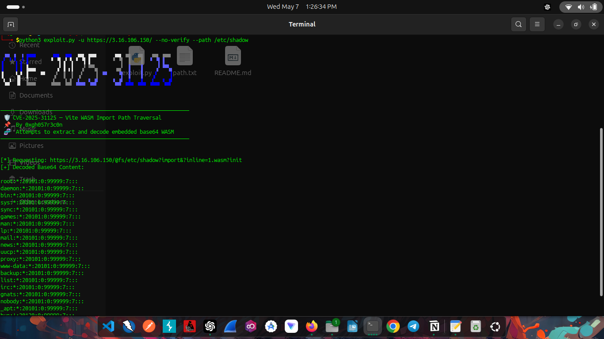

# CVE-2025-31125 Exploit - Vite WASM Import Path Traversal 🛡️

This script is a **proof-of-concept (PoC)** exploit for **CVE-2025-31125**, a vulnerability found in **Vite**. The exploit leverages a **WASM Import Path Traversal** issue to retrieve sensitive files from vulnerable servers running the Vite framework. It allows attackers to access files like `/etc/passwd`, `/etc/shadow`, `/etc/hosts`, and other sensitive files exposed by the server. ⚠️

---

## 🚨 **Disclaimer**

This tool is **for educational purposes only** and **should only be used on systems you own or have explicit permission to test**. **Unauthorized access to systems is illegal** and can result in legal consequences. **Use this tool responsibly**! ⚖️

---

## ✨ Features

- Exploits **Vite WASM Import Path Traversal** vulnerability (CVE-2025-31125). 🚀
- Extracts and decodes **embedded base64 WASM** content from vulnerable servers. 📜
- Supports multiple file paths, including `/etc/passwd`, `/etc/shadow`, and more! 💻
- Test multiple URLs from a **file** containing one URL per line. 🗂️
- **SSL certificate verification** can be disabled for testing environments. 🔐
- Custom path traversal for different file paths on vulnerable servers. 🛠️

---

## 🖥️ Requirements

- Python 3.6 or higher 🐍
- `requests` library 📦
- `urllib3` library 🔒
- `toilet` (optional, for banner) 🎨

### Install Python dependencies:

```bash
pip3 install -r requirements.txt
````

To install `toilet` (optional for banner) on your system:

* On **Ubuntu/Debian**: `sudo apt install toilet`
* On **MacOS**: `brew install toilet`

---

## 🚀 Installation

1. Clone the repository to your local machine:

```bash
git clone https://github.com/0xgh057r3c0n/CVE-2025-31125.git
cd CVE-2025-31125
```

2. Install required Python dependencies:

```bash
pip3 install -r requirements.txt
```

---

## 💻 Usage

To use the script, provide either a **single target URL** using `-u` or a **file with multiple target URLs** using `-f`.

### Available Arguments:

* `-u, --url`: Target a **single** URL. 🌐
* `-f, --file`: Provide a file with a list of target URLs (one per line). 📄
* `--path`: Specify the **path** to exploit (e.g., `/etc/passwd`, `/etc/shadow`). Default is `/etc/passwd`. 🛠️
* `--no-verify`: Disable **SSL verification** (useful for self-signed certificates). 🔒

### Examples:

#### Single Target with Default Path (`/etc/passwd`)

```bash
python3 exploit.py -u https://example.com --no-verify
```

#### Single Target with Custom Path (`/etc/shadow`)

```bash
python3 exploit.py -u https://example.com --no-verify --path /etc/shadow
```

#### Multiple Targets from File with Default Path (`/etc/passwd`)

```bash
python3 exploit.py -f targets.txt --no-verify
```

#### Multiple Targets from File with Custom Path (`/etc/hosts`)

```bash
python3 exploit.py -f targets.txt --no-verify --path /etc/hosts
```

---

## 📞 Contact Info

🙋‍♂️ **Contact (For Collaboration, Research & Cybersecurity Discussions):**

* 📞 **Phone**: +91 8876072154
* 📧 **Email**: [gauravbhattacharjee54@gmail.com](mailto:gauravbhattacharjee54@gmail.com)
* 🔗 **LinkedIn**: [Gaurav Bhattacharjee](https://www.linkedin.com/in/gaurav-bhattacharjee/)
* 🐙 **GitHub**: [0xgh057r3c0n](https://github.com/0xgh057r3c0n)
* 🌐 **Portfolio**: [https://0xgh057r3c0n.github.io/portfolio/](https://0xgh057r3c0n.github.io/portfolio/)

---

## 📝 License

This project is licensed under the **MIT License**. 🌟

---

## 🖼️ Logo



---

### ⚠️ **Important Note:**

* **Use this tool responsibly** only on authorized targets.
* **Unauthorized access to networks or systems is illegal.** 🔴
* This tool is **for educational purposes only**.

---
