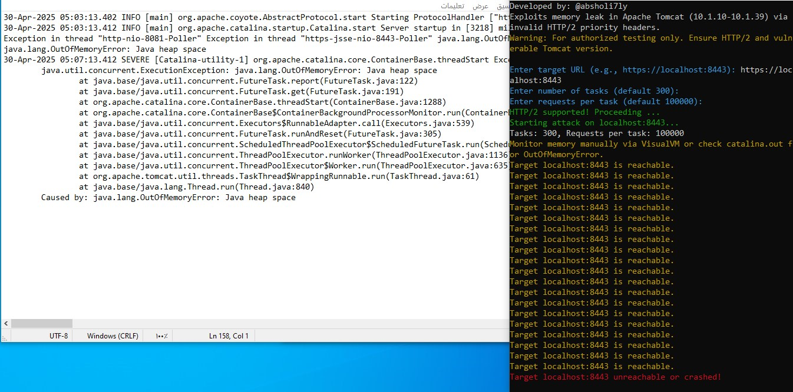

# TomcatKiller-CVE-2025-31650
A tool designed to detect the vulnerability **CVE-2025-31650** in Apache Tomcat (versions 10.1.10 to 10.1.39)
This vulnerability allows an attacker to trigger a **memory leak** by sending specially crafted HTTP/2 requests with invalid priority headers, leading to a denial-of-service (DoS) condition via an `OutOfMemoryError`.

--------------------------------------------------------------------------------

