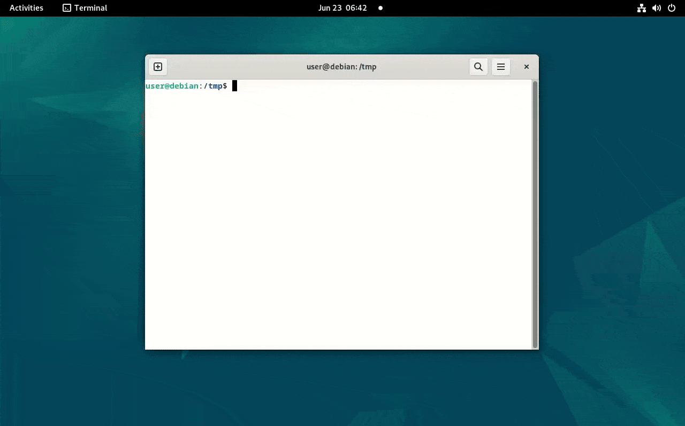

# CVE-2025-38001 (RBTree Family Drama)

**Linux HFSC Eltree Use-After-Free - Debian 12 PoC**

This PoC utilizes a page-level data-only attack based on RBTree transformations to compromise the system. The exploit is portable and works on all kernelCTF instances (LTS 6.6.90, COS 109, COS 105) and Debian 12. On Ubuntu LTS it only requires minor modifications due to Kmalloc Random Caches.

Vulnerability analysis and exploit development: https://syst3mfailure.io/rbtree-family-drama.

Fixed by commit [ac9fe7dd8e730a103ae4481147395cc73492d786](https://git.kernel.org/pub/scm/linux/kernel/git/torvalds/linux.git/commit/?id=ac9fe7dd8e730a103ae4481147395cc73492d786).

# Disclaimer

The exploit provided in this repository is intended for educational purposes only. The author does not condone or support any illegal activities or unauthorized access to systems. Use this information responsibly and only in environments where you have explicit permission to test. The author is not liable for any damages or consequences resulting from the use of this exploit.