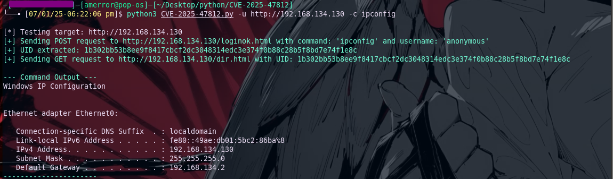

# CVE-2025-47812
Wing FTP Server Remote Code Execution (RCE) Exploit (CVE-2025-47812)


This repository hosts a Python exploit for the **Wing FTP Server Remote Code Execution (RCE) vulnerability (CVE-2025-47812)**. This critical flaw allows attackers to achieve remote code execution as root/SYSTEM on affected Wing FTP Server instances, even with anonymous access enabled.

## 🚀 Overview

This vulnerability originates from Wing FTP Server's improper handling of NULL bytes within the username parameter during the authentication process. This allows attackers to inject Lua code directly into session files. These malicious session files are then executed when a valid session is loaded, leading to arbitrary command execution on the server.

**Key features of this exploit include:**

* **Remote Code Execution:** Execute any command you choose on the target server.
* **Root/SYSTEM Privileges:** Often achieves RCE with the highest system privileges due to the default configurations of Wing FTP Server.
* **Anonymous Access Exploitation:** Can be leveraged even if only anonymous logins are permitted on the server.
* **Batch Scanning:** Scan multiple targets by providing a list of URLs from a file.
* **Custom Command Execution:** Specify and run any command you need on the vulnerable server.

## ⚠️ Disclaimer

This tool is intended strictly for **educational and authorized penetration testing purposes**. The author bears no responsibility for any misuse or damage caused by this software. Always ensure you have explicit, written permission before conducting any tests on a system.

## 🔎 Vulnerability Details (CVE-2025-47812)

The **CVE-2025-47812** vulnerability is a critical issue stemming from multiple weaknesses in how Wing FTP Server manages user authentication and sessions:

1.  **NULL Byte Truncation in `c_CheckUser()`:** The `c_CheckUser()` function, which is responsible for user authentication, internally uses `strlen()` on the provided username. When a **NULL byte (`%00`)** is injected into the username (e.g., `anonymous%00...`), `strlen()` truncates the string at this point. This means authentication succeeds for the portion of the username *before* the NULL byte, effectively bypassing proper validation.
2.  **Full Username in Session Creation:** Despite the authentication truncation, the `rawset(_SESSION, "username", username)` call within `loginok.html` uses the *entire*, unsanitized username directly from the GET or POST parameters. This includes the NULL byte and any subsequent characters.
3.  **Lua Code Injection:** Since session files are stored as Lua scripts, injecting Lua code after the NULL byte in the username (e.g., `anonymous%00]]%0dlocal+h+%3d+io.popen("id")%0dlocal+r+%3d+h%3aread("*a")%0dh%3aclose()%0dprint(r)%0d--`) results in this malicious code being written directly into the session file.
4.  **Session File Execution:** The `SessionModule.load()` function, invoked when any authenticated functionality (such as `/dir.html`) is accessed, directly executes the session file using `loadfile(filepath)` followed by `f()`. This crucial step triggers the injected Lua code, leading to **Remote Code Execution**.

This vulnerability is particularly severe because Wing FTP Server often runs with **root privileges on Linux** or **SYSTEM privileges on Windows** by default. This default configuration grants attackers maximum control over the compromised system upon successful exploitation.

**Affected Versions:** Wing FTP Server versions prior to **7.4.4** are vulnerable.

[What the NULL?! Wing FTP Server RCE (CVE-2025-47812)](https://www.rcesecurity.com/2025/06/what-the-null-wing-ftp-server-rce-cve-2025-47812/)

## 🛠️ Usage Options

This script supports various command-line arguments to tailor its functionality.

```bash
python3 CVE-2025-47812.py -h

```
```bash

usage: CVE-2025-47812.py.py [-h] [-u URL] [-f FILE] [-c COMMAND] [-v] [-o OUTPUT] [-U USERNAME]

Exploit script for command injection via login.html.

options:
  -h, --help            show this help message and exit
  -u URL, --url URL     Target URL (e.g., [http://192.168.134.130](http://192.168.134.130)). Required if -f not specified.
  -f FILE, --file FILE  File containing list of target URLs (one per line).
  -c COMMAND, --command COMMAND
                        Custom command to execute. Default: whoami. If specified, verbose output is enabled automatically.
  -v, --verbose         Show full command output (verbose mode). Ignored if -c is used since verbose is auto-enabled.
  -o OUTPUT, --output OUTPUT
                        File to save vulnerable URLs.
  -U USERNAME, --username USERNAME
                        Username to use in the exploit payload. Default: anonymous
```

```bash
python3 CVE-2025-47812.py -u http://192.168.134.130 -c ipconfig

```


