```mermaid
%%{init: {'theme': 'base', 'themeVariables': { 'fontSize': '13px', 'fontFamily': 'Consolas, monospace', 'primaryColor': '#d32f2f', 'primaryTextColor': '#fff', 'lineColor': '#ff8a80', 'secondaryColor': '#1976d2'}}}%%
sequenceDiagram
    participant Attacker as 🌐 Attacker
    participant Network as 📡 Network
    participant Device as 📱 Android Device
    participant Kernel as 🛠 Kernel Space

    Attacker->>Network: Send Malicious Packet<br/>(No authentication)
    Network->>Device: Deliver Packet<br/>(Zero interaction)
    Device->>Device: process_system_packet(pkt)
    Note over Device: ⚠️ No bounds check!
    Device->>Kernel: memcpy(kernel_buffer, payload, size)
    Kernel-->>Device: Buffer Overflow
    Device->>Kernel: Execute Injected Code
    Kernel->>Attacker: Remote Shell / Data Exfiltration
    Note over Device,Kernel: 🔥 Full RCE Achieved
```

# 🚨 **CVE-2025-48593 Zero-Click Remote Code Execution in Android System** 🚨

> **"A single malicious packet can own your device."** — *Android Security Team, Nov 2025*

---

## 🎯 **Vulnerability Snapshot**

| **Attribute**             | **Details**                                                                 |
|---------------------------|-----------------------------------------------------------------------------|
| **CVE ID**                | **CVE-2025-48593**                                                          | 
| **Severity**              | **🔴 Critical** *(RCE, Zero-Click)*                                        |
| **CVSS (Est.)**           | **9.8** *(Pending NVD confirmation)*                                       |
| **Attack Vector**         | 🌐 **Network (Remote)**                                                    |
| **User Interaction**      | ❌ **None Required**                                                       |
| **Privileges Required**   | ❌ **None**                                                                 |
| **Exploit Status**        | 🟡 **No public PoC** *(as of Nov 4, 2025)*                                 |

---

## 🛡️ **Affected Devices & Versions**

```diff
- Android 13 (All builds Oct 2023 – Oct 2025)
- Android 14 (All builds Oct 2023 – Oct 2025)
- Android 15 (All builds up to Oct 2025)
! Android 16 (Builds Jul 2025 – Oct 2025)
```

> **Unpatched devices are fully exposed.**

---

## ⚡ **How It Works (Technical Breakdown)**

```c
// Simplified pseudocode of vulnerable path
void process_system_packet(Packet *p) {
    if (p->type == MALICIOUS_TYPE) {
        // ⚠️ No bounds check!
        memcpy(kernel_buffer, p->payload, p->size);  // CVE-2025-48593
        execute_payload(); // RCE achieved
    }
}
```

**Root Cause**:  
> **Improper input validation** in the `System` component allows **remote attackers to overflow buffers** and inject executable code.

---

## 🛑 **Immediate Mitigation Steps**

```bash
# 1. Check your patch level
adb shell getprop ro.build.version.security_patch
# → Should show: 2025-11-01 or 2025-11-05
```

### **User Actions**
1. **Update Now**  
   ⚙️ *Settings → System → System Update*
2. **Enable Play Protect**  
   🔍 *Google Play → Play Protect → Scan*
3. **Avoid Untrusted Networks**  
   🚫 Disable Wi-Fi/Bluetooth in public

### **Enterprise / OEM**
- Apply **2025-11-05** security patch via AOSP
- Monitor: [Android Security Bulletin – November 2025](https://source.android.com/docs/security/bulletin/2025-11-01)

---

## 🔗 **Related CVEs (Same Bulletin)**

| CVE                | Severity | Type           | Affected |
|--------------------|----------|----------------|----------|
| `CVE-2025-48581`   | High     | EoP            | Android 16 only |

---

## 📢 **Stay Updated**

🔍 **NVD Entry**: [nvd.nist.gov/vuln/detail/CVE-2025-48593](https://nvd.nist.gov/vuln/detail/CVE-2025-48593)  
🔗 **Android Bulletin**: [source.android.com/security/bulletin](https://source.android.com/docs/security/bulletin/2025-11-01)  
🛠️ **AOSP Patch**: Search `CVE-2025-48593` in [Android Git](https://android.googlesource.com)


---

# 🛠 **CVE-2025-48593 Exploitation Schema**  
### *Zero-Click Remote Code Execution in Android System*

---



---

## 🔍 **Technical Attack Chain**

| **Stage**               | **Action**                                      | **Requirement**           |
|-------------------------|--------------------------------------------------|---------------------------|
| 1. **Packet Crafting**   | Attacker builds malformed system packet          | None                      |
| 2. **Transmission**      | Sent over Wi-Fi, Bluetooth, or cellular          | Network access            |
| 3. **Reception**         | Device receives packet (no user action)          | Unpatched Android 13–16   |
| 4. **Processing**        | `System` component parses input                  | Vulnerable code path      |
| 5. **Overflow**          | `memcpy()` writes beyond buffer                  | Input validation flaw     |
| 6. **Execution**         | Shellcode runs in kernel context                 | Zero-click RCE            |
| 7. **Persistence**       | Install malware, exfiltrate data, pivot          | Full control              |

---

## 🛡️ **Defense-in-Depth Schema**

```mermaid
graph LR
    subgraph "Prevention Layers"
        P1[🔒 Apply Nov 2025 Patch]
        P2[🚫 Disable Unused Radios]
        P3[🛡️ Google Play Protect]
        P4[🌐 Avoid Public Wi-Fi]
    end

    subgraph "Detection"
        D1[📊 Monitor Anomalous Traffic]
        D2[⚠️ Watch for Kernel Crashes]
        D3[🔍 Endpoint Forensics]
    end

    subgraph "Response"
        R1[🛑 Isolate Device]
        R2[📲 Force OTA Update]
        R3[📋 Report to Google/OEM]
    end

    P1 & P2 & P3 & P4 --> D1 & D2 & D3 --> R1 & R2 & R3

    style P1 fill:#1b5e20, color:#fff
    style R1 fill:#b71c1c, color:#fff
```



---

## 📋 **Patch Application Flow**

```mermaid
%%{init: {'theme': 'neutral'}}%%
graph TD
    A[Google Releases Patch<br/>Nov 1/5, 2025] --> B{OEM Integration}
    B --> C[Samsung, OnePlus, etc.]
    B --> D[Google Pixel]
    C --> E[Monthly Security Update]
    D --> F[Pixel OTA Push]
    E & F --> G[User Installs Update]
    G --> H[Patch Level: 2025-11-01+]
    H --> I[✅ CVE-2025-48593 Mitigated]

    style A fill:#1976d2, color:#fff
    style I fill:#1b5e20, color:#fff
    style G fill:#ff9800, color:#fff
```



---

> **Unpatched = Exposed**  
> **Patched = Protected**

*Schema last updated: November 4, 2025*  
*For AOSP patch diff, search `CVE-2025-48593` in Android Git*
