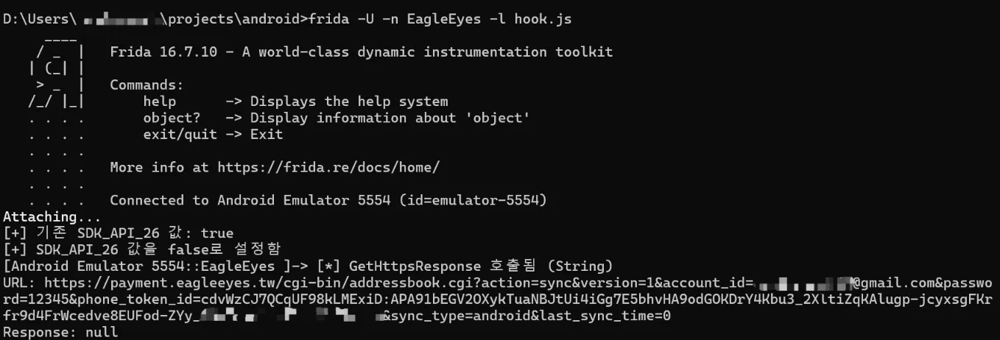

# CVE-2025-50110
### Cleartext Transmission of Sensitive Information in EagleEyes Lite Android Application

## 1. Overview


<br clear="left"/>

- **Application**: EagleEyes(Lite)  
- **Version**: 2.0.0  
- **Vendor**: AVTECH  
- **CWE**: [CWE-319: Cleartext Transmission of Sensitive Information](https://cwe.mitre.org/data/definitions/319.html)  
- **CVSS**:   
- **Vector String**:   
## 2. Summary
In EagleEyes Lite (version 2.0.0), the method `GetHttpsResponse()` transmits sensitive information such as account IDs, passwords, device tokens, and internal server URLs directly within the query string of an HTTPS request.   
Because these credentials and tokens are embedded in the URL rather than being securely placed in the request body, they can be easily extracted by any adversary performing an MITM attack.   
Even though the connection nominally uses HTTPS, the exposure of such sensitive parameters in plaintext within the URL significantly increases the risk of credential leakage and unauthorized access to AVTECH CCTV systems.   
This weakness undermines the confidentiality of user data and makes the application particularly vulnerable when operating on untrusted networks.
## 3. Details
When the device runs on Android versions below 8.0, meaning `SDK_API_26` is set to `false`, the method does not return `GetHttpsUrlResponse()`.  
Instead, it executes the vulnerable logic inside the `try` block.  
```java
public static String GetHttpsResponse(String str) {
    if (SDK_API_26) {
        return GetHttpsUrlResponse(str);
    }
    try {
        ...
        HttpResponse execute = new DefaultHttpClient(
            new SingleClientConnManager(defaultHttpClient.getParams(), schemeRegistry), 
            defaultHttpClient.getParams()
        ).execute(new HttpPost(str));
        ...
    }
    ...
}
```
Here, the parameter `str` contains the full request URL, which embeds sensitive information such as `account_id` and `password` directly in the query string.  
As a result, user credentials are exposed in plaintext within the URL, making them susceptible to leakage if intercepted through an MITM attack or logged by intermediate systems.
## 4. Proof of Concept (PoC)
By running the Frida hooking script [hook.js](hook.js), we confirmed that the `GetHttpsResponse()` method was invoked, and that the generated request URL contained sensitive information (such as `account_id` and `password`) in plaintext.



For detailed analysis of the vulnerable `GetHttpsResponse()` implementation, please refer to [CVE-2025-46408](https://github.com/shinyColumn/CVE-2025-46408).

## 5. Recommendations
The application should never include sensitive information such as account ID, password, or authentication tokens in URL query parameters.   
Instead, credentials must be transmitted securely within the HTTPS request body using POST parameters. This prevents sensitive values from being exposed in URLs, logs, or intermediary systems.

## 6. References
- https://github.com/shinyColumn/CVE-2025-46408
- https://github.com/shinyColumn/CVE-2025-50944
