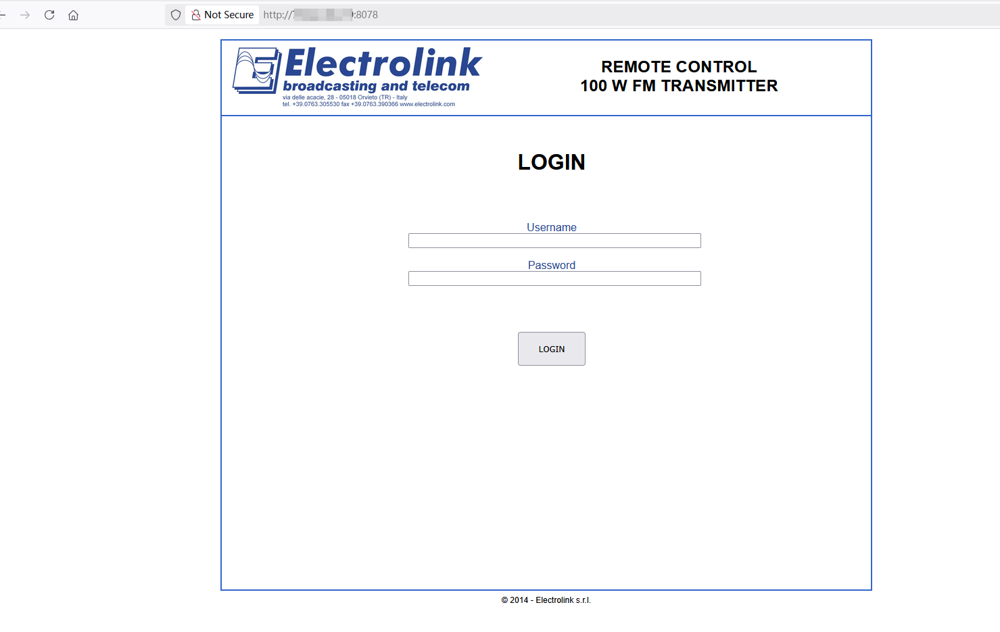
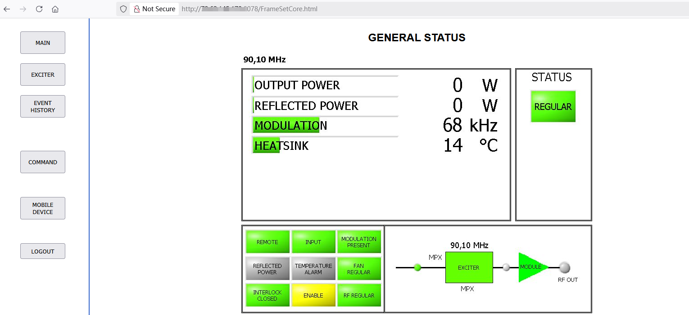

# Electrolink-FM-DAB-TV For CVE-2025-51040
Electrolink FM/DAB/TV Transmitter Web Management System Unauthorized access vulnerability in Electrolink 500W, 1kW, 2kW Medium DAB Transmitter Web v01.09, v01.08, v01.07, and Display v1.4, v1.2 

## Description
Electrolink FM/DAB/TV Transmitter web management system is vulnerable to Unauthorized access.An attacker can enter the backend by visiting /FrameSetCore.html, leading to unauthorized administrative access and complete system compromise.

## Vendor of the Product(s)
Electrolink
## Vendor Homepage
<https://www.electrolink.com>
## Affected Product(s)/Code Base
Product: Electrolink FM/DAB/TV Transmitter Web Management System
## Vulnerable Endpoint
/FrameSetCore.html
## Attack Type
Insecure Permissions
## Impact
An unauthenticated attacker can access the /FrameSetCore.html file via HTTP, which  compromises system security and could lead to unauthorized access.

## Poc
`/FrameSetCore.html`

## Suggested Fixes
1 Access Control: Restrict access to sensitive files using authentication mechanisms.
2 Code Refactoring: Remove hard-coded credentials from JavaScript files.
3 Data Masking: Avoid storing sensitive information in client-side resources.
4 Security Review: Conduct a thorough security audit to detect similar vulnerabilities.
5 Monitoring & Alerts: Implement monitoring and alerting for unauthorized access attempts.
