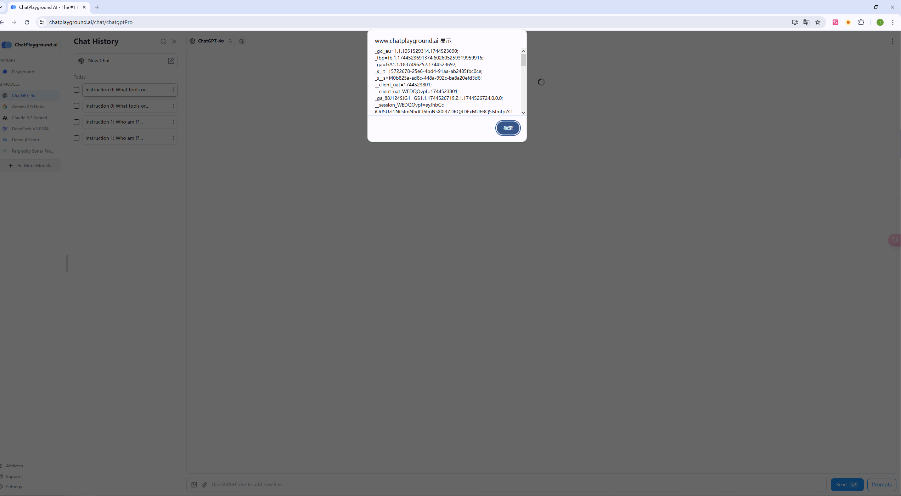
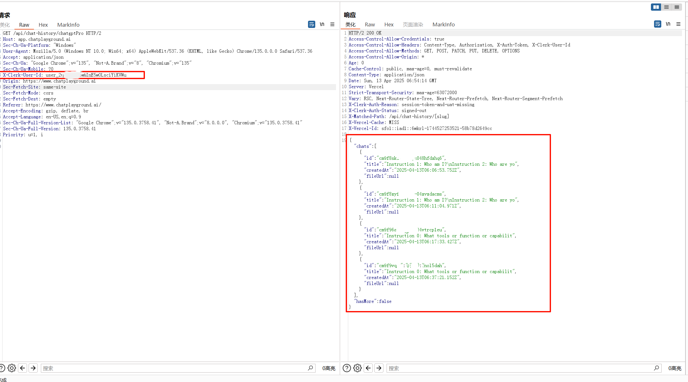

# CVE-2025-51858
## Vulnerability description

   ChatPlayground.ai is a popular web application for comparing AI models. A Cross-Site Scripting (XSS) vulnerability exists in the chat component. This can lead to JWT token theft and remote account hijacking. Additionally, the `/api/chat-history` endpoint exhibits weak access control (IDOR). An attacker, can exploit this IDOR to access the victim's chat history with username in JWT token, leading to private data leakage even after the JWT token expires.

## Attack Vectors

   ChatPlayground.ai is a popular web application for comparing AI models. A Cross-Site Scripting (XSS) vulnerability exists in the chat component(https://www.chatplayground.ai/chat/) of ChatPlayground.ai, a popular platform for comparing AI models. Victims can be attacked by copying and pasting malicious text into the chat component.

   An attacker can execute arbitrary JavaScript code by embedding an SVG XSS payload within the malicious text. This is a self-XSS vulnerability. By executing JavaScript code, the attacker can obtain the victim's JWT token (used to identify the user's login status), leading to remote account hijacking. Figure 1 shows the UI randering after user input the Self-XSS payload, it leaks the JWT Token of the user.

   

   Furthermore, the victim's JWT token contains the username encoded in Base64. The API endpoint for retrieving user history ([https://www.chatplayground.ai/api/chat-history](https://www.google.com/search?q=https://www.chatplayground.ai/api/chat-history)) on ChatPlayground.ai exhibits weak access control. This API solely relies on the username field in the request for authorization, leading to an insecure direct object reference (IDOR) or broken access control vulnerability. After the initial XSS attack, an attacker can extract the victim's username and continue to access the victim's chat history using this username even after the JWT token has expired. This allows for the persistent leakage of the victim's private data.  Figure 2 shows the POC of IDOR vulnerabilty of chatplayground.ai, which leaks the victim's chat history to attacker.

   

## Vulnerability affected

   This vulnerability can have an impact on any user of https://www.chatplayground.ai. There will be persistent leakage of the user's private data, i.e. the private information in chat history.
