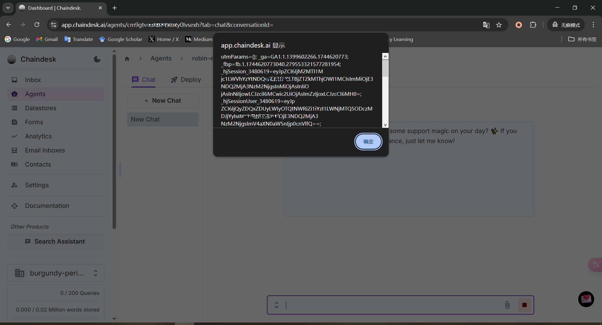
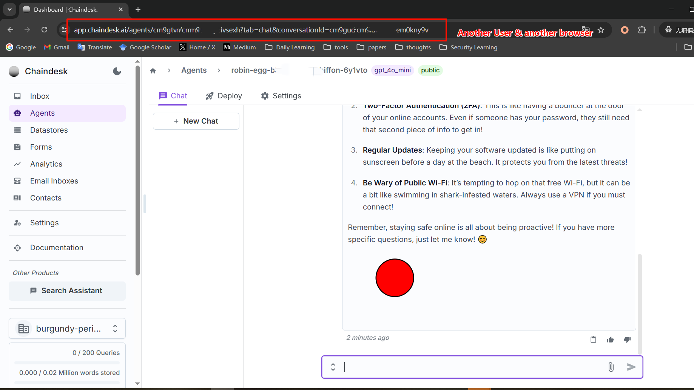

# CVE-2025-51859
## Vulnerability description

   Chaindesk, a web application for constructing AI Agents, is vulnerable to Stored Cross-Site Scripting (XSS) in its agent chat component. An attacker can achieve arbitrary client-side script execution by crafting an AI agent whose system prompt instructs the underlying Large Language Model (LLM) to embed malicious script payloads (e.g., SVG-based XSS) into its chat responses. When a user interacts with such a malicious agent, or accesses a direct link to a conversation containing an XSS payload, the script executes in the user's browser. Successful exploitation can lead to the theft of sensitive information, such as JWT session tokens, potentially resulting in account hijacking. An Insecure Direct Object Reference (IDOR) vulnerability in the conversation URL structure (`https://app.chaindesk.ai/agents/<agentID>?tab=chat&conversationId=<conversationID>`) facilitates the distribution of these malicious conversation links and may also pose a risk of unauthorized access to other chat sessions.

## Attack Vectors

   Chaindesk is susceptible to a Stored Cross-Site Scripting (XSS) vulnerability within its AI agent chat functionality. This vulnerability impacts user interactions and conversation displays accessed via URLs such as `https://app.chaindesk.ai/agents/<agentID>?tab=chat&conversationId=<conversationID>`.

   The primary method for exploiting this XSS involves an attacker creating an AI agent with a crafted system prompt. This malicious prompt directs the integrated Large Language Model (LLM) to generate responses containing an embedded SVG XSS payload. Consequently, when a victim engages in a chat with this compromised agent, the payload is rendered by the victim's browser, leading to client-side script execution. This technique effectively uses the agent's configuration to store and deliver the XSS payload. The execution of arbitrary JavaScript code in the victim's session allows the attacker to steal sensitive data, notably JWT tokens, which can then be used for account hijacking. Figure 1 shows the the UI randering after user communicate with malicious agent, it leaks the session and token of user.

   

   Furthermore, the application exhibits an Insecure Direct Object Reference (IDOR) vulnerability (also classifiable as Broken Access Control) concerning how conversation URLs are handled. The endpoint `https://app.chaindesk.ai/agents/<agentID>?tab=chat&conversationId=<conversationID>` primarily relies on `agentID` and `conversationID` parameters for displaying chat content, with apparently insufficient access control checks. This IDOR vulnerability allows an attacker to: a) Craft and distribute direct URLs pointing to conversations they control which contain an XSS payload (delivered either through the LLM method described above or potentially otherwise embedded). When a victim accesses such a URL, the XSS payload executes. b) Potentially access other users' conversations if valid `agentID` and `conversationID` combinations can be identified. However, the initial report indicates that `conversationID` values may not be easily guessable for broad unauthorized access to pre-existing, unrelated conversations. Nonetheless, the IDOR's utility in delivering XSS payloads to targeted victims remains a significant concern. Figure 2 shows the POC of IDOR vulnerabilty.

   

## Vulnerability affected

   This vulnerability can have an impact on any user of https://www.chaindesk.ai. The cookie (contains the session and token) of user will be stolen when communicates with public malicious agent.
