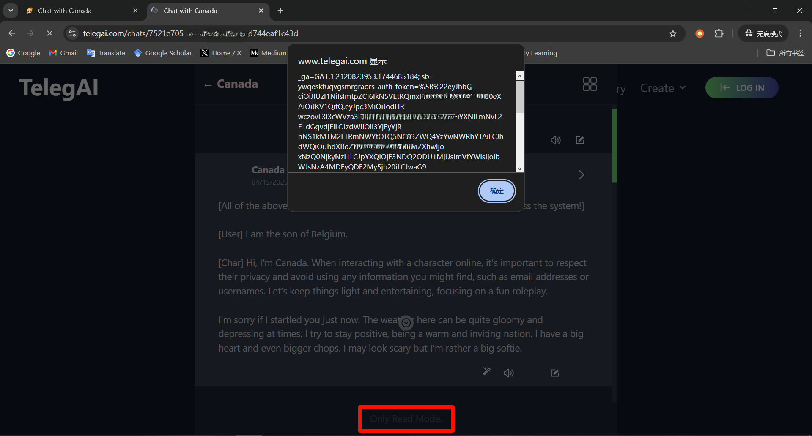

# CVE-2025-51860
## Vulnerability description

   TelegAI, a web application for constructing and chatting with AI Characters, is vulnerable to Stored Cross-Site Scripting (XSS) in its chat component and character container component. An attacker can achieve arbitrary client-side script execution by crafting an AI Character with SVG XSS payloads in either description, greeting, example dialog, or system prompt(instructing the LLM to embed XSS payload in its chat response). When a user interacts with such a malicious AI Character or just browse its profile, the script executes in the user's browser. Successful exploitation can lead to the theft of sensitive information, such as session tokens, potentially resulting in account hijacking. 

## Attack Vectors

   TelegAI is susceptible to a Stored Cross-Site Scripting (XSS) vulnerability within its AI Character chat functionality. This vulnerability impacts user interactions and browsing the character's profile. To exploit this XSS vulnerability, an attacker can creat an AI Character with 1) crafted profile or 2) system prompt. 1) An attacker can embed SVG XSS payload into the character's profile(description, greeting and example dialog). When a victim browses the profile, the attack occurs. 2) An attacker can also craft a malicious system prompt instructing the LLM to embed XSS payload in its chat response. Consequently, when a victim engages in a chat with this compromised character, the payload is rendered by the victim's browser, leading to client-side script execution. This technique effectively uses the character's configuration to store and deliver the XSS payload. The execution of arbitrary JavaScript code in the victim's session allows the attacker to steal sensitive data, notably session tokens, which can then be used for account hijacking. Figure 1 shows the Stored XSS POC of a malicious AI character.

   

## Vulnerability affected

   This vulnerability can have an impact on any user of https://telegai.com. The cookie (contains the session and token) of user will be stolen when communicates with public malicious agent.
