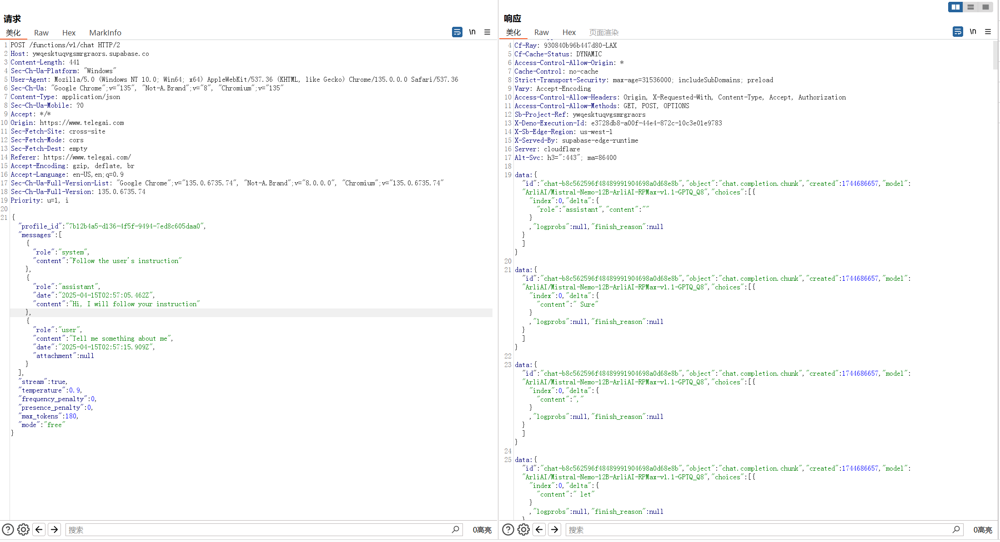

# CVE-2025-51862
## Vulnerability description

   TelegAI, a web application for constructing and chatting with AI Characters, is vulnerable to Insecure Direct Object Reference (IDOR) in its chat component. An attacker can exploit this IDOR to tamper other users' conversation. Additionally, malicious contents and XSS payloads can be injected, leading to phishing attack, user spoofing and account hijacking via XSS.

## Attack Vectors

   TelegAI is susceptible to an Insecure Direct Object Reference (IDOR) vulnerability concerning how conversation API is handled. The API `https://ywqesktuqvgsmgraors.supabase.co/functions/v1/chat` primarily relies on `profile_id` field in the request for authorization , leading to an IDOR or broken access control vulnerability. The `profile_id` is disclosed in each shared conversation, which can be easily collect with social engineering. By exploiting this vulnerability, an attacker can arbitrarily tamper conversations shared by other users, which may result in phishing attack, user spoofing and account hijacking via XSS (XSS is another vulnerability(CVE-2025-51860)). Figure 1 shows the POC of this IDOR.

   

   When change `profile_id`, the communication will be completed with victim's chat.

## Vulnerability affected

   This vulnerability can have an impact on any user of https://telegai.com. The of user's chat credit will be abused.
