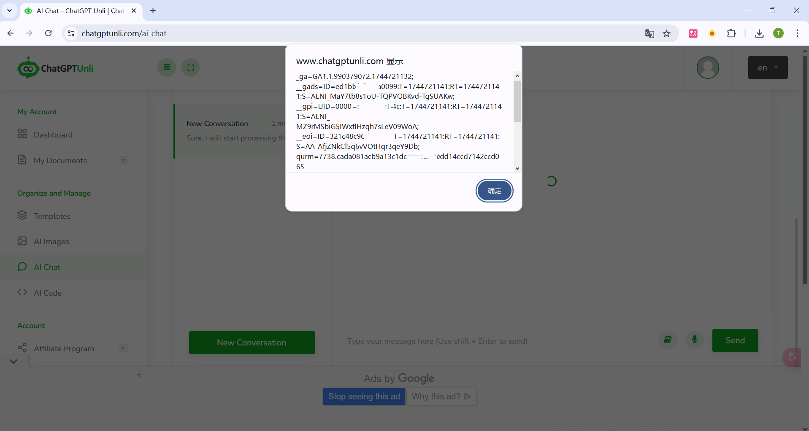

# CVE-2025-51863
## Vulnerability description

   ChatGPTUtil is a AI-powered chatbot assistant, providing access to both ChatGPT and an AI image generator. A Self Cross-Site Scripting (Self-XSS) vulnerability exists in the chat component. This can lead to cookie theft leading to remote account hijacking. 

## Attack Vectors

   The attack vector is the Network. To exploit this XSS vulnerability, an attacker must craft a malicious payload (i.e., an SVG XSS payload) and deliver it to the victim (e.g., via email, a malicious website, a forum post, or an instant message). The attack occurs when the victim pastes the payload into the ChatGPTUtil chat interface. The POC as following:

   ```
   
   <svg xmlns="http://www.w3.org/2000/svg" version="1.1"><circle cx="100" cy="50" r="40" stroke="black" stroke-width="2" fill="red" /> <script>alert(document.cookie)</script></svg>
   ```

   

## Vulnerability affected

   This vulnerability can have an impact on any user of https://www.chatgptunli.com. The cookie (contains the session and token) of user will be stolen when pastes the payload into the chat interface.
