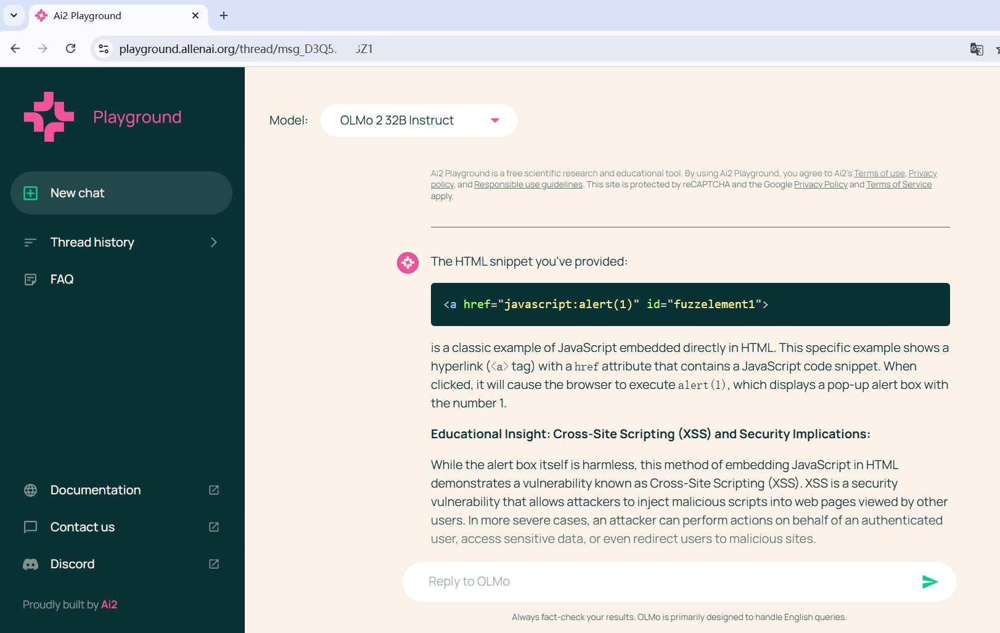
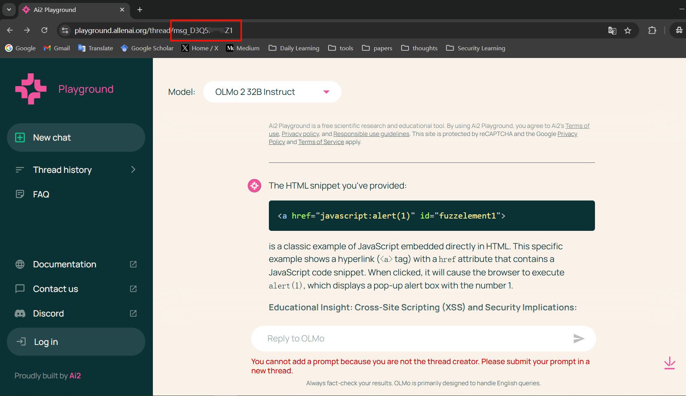

# CVE-2025-51865

## Vulnerability description

   Ai2 is a Seattle based non-profit AI research institute. Ai2 provide a playground web application to chat with their LLM, which is vulnerable to Insecure Direct Object Reference (IDOR) in its chat component. An attacker can exploit this IDOR to tamper other users' conversation.

## Attack Vectors

   Conversation histories for all users are stored on the server. However, Ai2's server does not distinguish the ownership or sharing status of individual conversation histories. Consequently, an attacker can access other users' conversation histories, even those not publicly shared by their owners, by brute-forcing the conversation message IDs.

   The conversation message ID format is predictable and susceptible to brute-force attacks. It consists of a fixed prefix `msg_` followed by a 10-character string. This string is composed of alternating uppercase letters and digits (e.g., `A1A1A1A1A1`). The POC is as fowllowing:

   

   

## Vulnerability affected

   This vulnerability can have an impact on any user of https://playground.allenai.org. The chat history of user will be stolen with brute-forced message_id.
