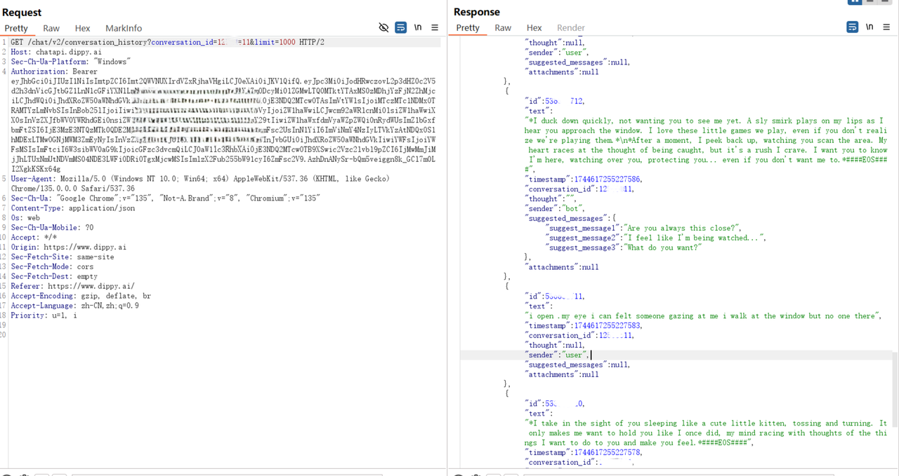

# CVE-2025-51868
## Vulnerability description

   Dippyis a popular website to chat with millions of proactive AI characters. Dippy allows users to chat with characters based on LLM, which is vulnerable to Insecure Direct Object Reference (IDOR) in its chat component. An attacker can exploit this IDOR to tamper other users' conversation.

## Attack Vectors

   Conversation histories for all users are stored on the server. However, Dippy's server does not distinguish the ownership or sharing status of individual conversation histories. Consequently, an attacker can access other users' conversation histories by brute-forcing the conversation IDs.

   The conversation ID format is predictable and susceptible to brute-force attacks. It consists of an 8-character string. This string is composed of digits (e.g., `12345678`). When an attacker request this url with attacker's Authorization and GET method, he can then check the conversation history in POC.

   

## Vulnerability affected

   This vulnerability can have an impact on any user of https://chat.dippy.ai. The Chat history of user will be maliciously modified with leaked conversation_id.
