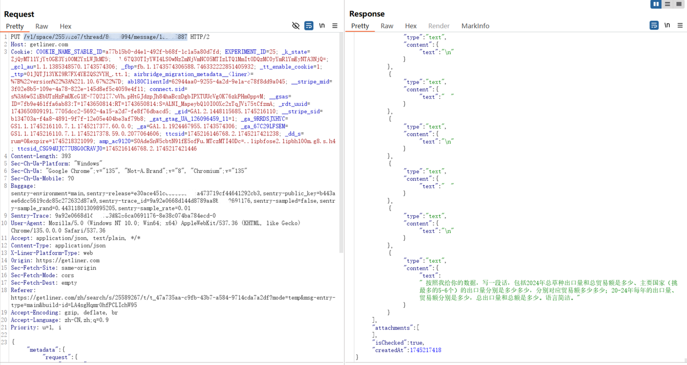

# CVE-2025-51869
## Vulnerability description

   Liner is a reliable AI search engine with over 10 million users worldwide. Liner construct a search engine based on LLM, which is vulnerable to Insecure Direct Object Reference (IDOR) in its chat component. An attacker can exploit this IDOR to tamper other users' conversation.

## Attack Vectors

   Conversation histories for all users are stored on the server. However,Liner's server does not distinguish the ownership or sharing status of individual conversation histories. Consequently, an attacker can access other users' conversation histories by brute-forcing the conversation message IDs. Also there are space_id and thread_id, we found that when requesting a conversation history the server only checks the message_id to retrieve conversation.

   The message ID format is predictable and susceptible to brute-force attacks. It consists of an 9-character string. This string is composed of digits (e.g., `123456789`) and this id is in ascending order. When an attacker request this api with attacker's Authorization and GET method, he can then check the conversation history in POC.

   

## Vulnerability affected

   This vulnerability can have an impact on any user of https://getliner.com. The Chat history of user will be tampered with brute-forced message_id.
