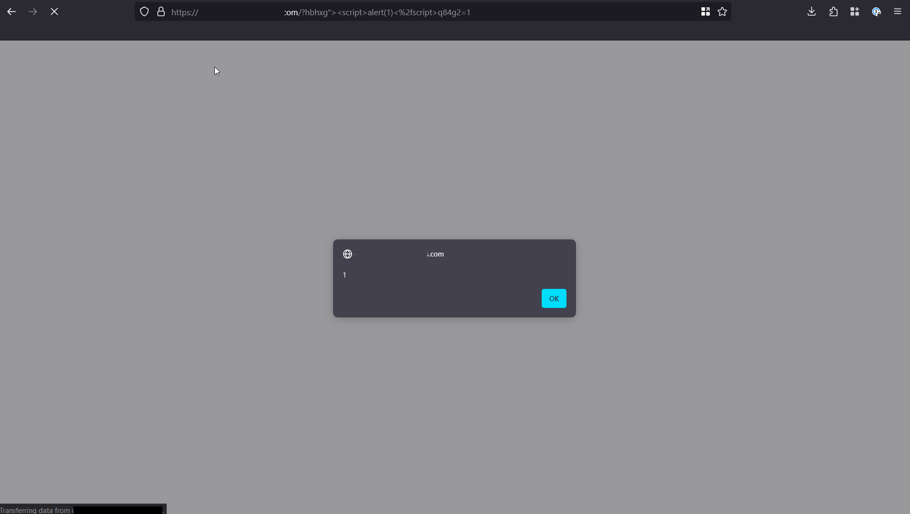
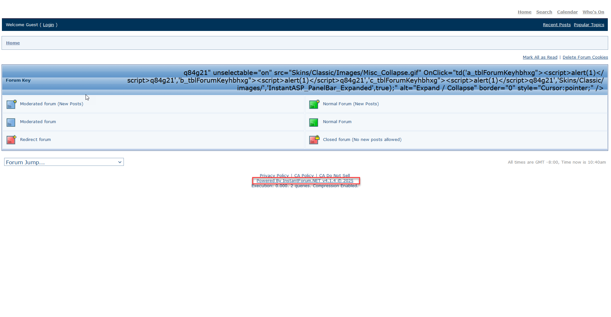

# CVE-2025-52097: Reflected Cross-Site Scripting (XSS) in InstantForum.NET v4.1.4

## Summary

A **reflected cross-site scripting (XSS) vulnerability** exists in **InstantASP Ltd. InstantForum.NET v4.1.4**, a popular ASP.NET forum software. The vulnerability allows remote attackers to execute arbitrary JavaScript in the context of a victim’s browser session by injecting a payload via the `hbhxg` query string parameter.

---

## Vulnerability Details

- **CVE ID:** CVE-2025-52097
- **Severity:** Medium
- **Type:** Reflected Cross-Site Scripting (XSS)
- **Vendor:** InstantASP Ltd.
- **Product:** InstantForum.NET
- **Version:** v4.1.4 (latest version tested)
- **Platform:** Windows Server (IIS + .NET Framework)
- **Attack Vector:** Remote (victim visits crafted URL)

---

## Technical Description

The vulnerability exists because **user input from the `hbhxg` query string parameter is reflected into the HTML response without proper sanitization or output encoding**. This allows an attacker to inject arbitrary JavaScript, resulting in:

- Execution of malicious scripts in the context of the victim’s browser
- Potential session hijacking, phishing, or redirection attacks
- Information disclosure through DOM inspection or token theft

---

### Example Exploitation

A crafted URL such as:

```
https://target-forum.com/?hbhxg=%22%3E%3Cscript%3Ealert(1)%3C/script%3E
```

where:

- **Parameter:** `hbhxg`
- **Payload:** `"><script>alert(1)</script>`

results in the input being reflected into the page unsanitized, triggering execution of the injected JavaScript when visited by a victim.

---

## Proof of Concept

**Screenshot 1:** Successful XSS payload execution triggering an alert box in the victim's browser.



**Screenshot 2:** Injection reflected within the forum page without authentication required, confirming exploitation on InstantForum.NET v4.1.4.



*Note:* IP addresses and sensitive URLs have been sanitized for public disclosure.

---

## Impact

- **Code execution:** Arbitrary JavaScript in victim browser
- **Information disclosure:** Possible if used to harvest session cookies or DOM data
- **User interaction required:** Victim must click or be redirected to attacker-controlled URL

---

## Remediation

**Official Fix:**  
No official patch is available. The vendor (InstantASP Ltd.) is no longer in operation. 
**Recommended Actions:**  
- Implement proper input validation and output encoding for all reflected parameters.  
- Use context-appropriate encoding libraries such as **Microsoft AntiXSS** or built-in ASP.NET encoding methods.  
- Consider migrating to actively maintained forum platforms to ensure ongoing security support.  
- Deploy a Web Application Firewall (WAF) to block common XSS payloads as an interim mitigation.

---

## Disclosure Timeline

- **2025-05-29:** Vulnerability discovered by Ryan Wilson (ECS MSP ARC Red Team)
- **2025-05-29:** Vendor contact attempted (vendor no longer in operation)
- **2025-07-11:** CVE assigned (CVE-2025-52097)
- **2025-07-11:** Public advisory released

---

## References

- [InstantASP Ltd.](http://instantasp.com)
- [InstantForum.NET](http://instantforumnet.com)
- [MITRE CVE Record](https://cve.mitre.org/cgi-bin/cvename.cgi?name=CVE-2025-52097) *(update link once public)*

---

## Credits

**Discovered by:** Ryan Wilson, ECS MSP ARC Red Team

---

> **Disclaimer:**  
> This advisory is provided for educational and defensive security purposes. The author and organization disclaim liability for misuse of the information provided herein.
