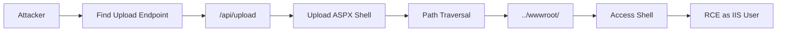

# CVE-2025-52691

**SmarterMail Unauthenticated Arbitrary File Upload RCE**

## Overview

Critical unauthenticated arbitrary file upload allowing remote code execution.

| Field | Value |
|-------|-------|
| Product | SmarterMail |
| Affected | Build 9406 and earlier |
| CVSS | 10.0 (Critical) |
| Type | Arbitrary File Upload |
| Vector | HTTP (unauthenticated) |
| Impact | Remote Code Execution |

## Attack Flow



## Technical Details

The vulnerability allows unauthenticated attackers to upload arbitrary files to any server location. By uploading an ASPX webshell to the webroot, attackers achieve code execution.

**Attack Steps:**
1. Upload ASPX webshell via vulnerable endpoint
2. Use path traversal to write to wwwroot
3. Access uploaded shell via HTTP
4. Execute arbitrary commands

## Usage

```bash
python exploit.py https://mail.target.com

python exploit.py https://mail.target.com -c "whoami"

python exploit.py https://mail.target.com -c "net user"
```

## Parameters

| Flag | Description | Default |
|------|-------------|---------|
| `-c, --command` | Command to execute | none |
| `-t, --timeout` | Request timeout | 30 |
| `--check-only` | Only check if alive | off |

## Requirements

```
requests
```

## Mitigation

- Update to SmarterMail Build 9413 or later
- Restrict access to management interfaces
- Implement WAF rules

## Disclaimer

For authorized security testing only.
