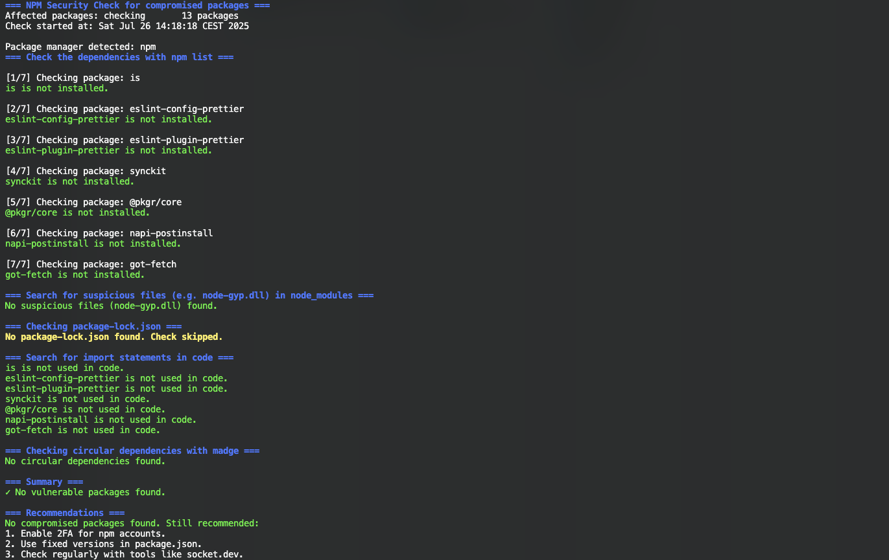

# cve-2025-54313
Checks projects for compromised packages, suspicious files, and import statements, see [is Supply Chain attack](https://socket.dev/blog/npm-is-package-hijacked-in-expanding-supply-chain-attack)

## How?

Just execute the script in the terminal/console. Consider to install `maple` first.

```sh
npm install -g maple
chmod +x cve-2025-545313.sh
./cve-2025-54313.sh
```



## License

This project is licensed under the GNU Lesser General Public License (LGPL), version 3 or (at your option) any later version.
You may use, modify, and distribute this software under the terms of the LGPL as published by the Free Software Foundation. See the [LICENSE](LICENSE) file for details.
This program is distributed in the hope that it will be useful, but WITHOUT ANY WARRANTY; without even the implied warranty of MERCHANTABILITY or FITNESS FOR A PARTICULAR PURPOSE. See the GNU Lesser General Public License for more details.
You should have received a copy of the GNU Lesser General Public License along with this program. If not,
