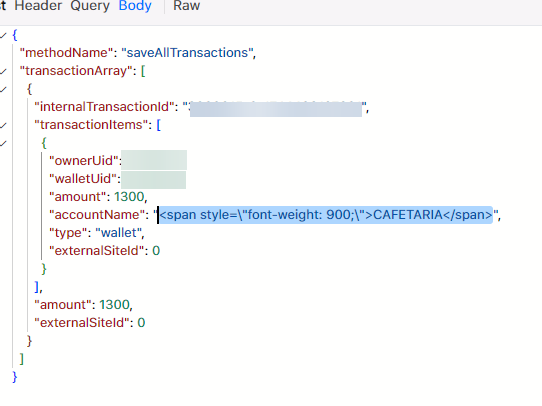
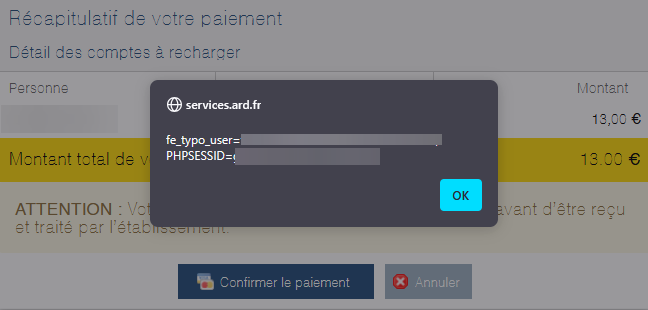

# CVE-2025-55888
### Description
Cross-Site Scripting (XSS) vulnerability was discovered in the Ajax
transaction manager endpoint of ARD. An attacker can intercept the Ajax
response and inject malicious JavaScript into the accountName field.
This input is not properly sanitized or encoded when rendered, allowing
script execution in the context of users browsers. This flaw could lead
to session hijacking, cookie theft, and other malicious actions.

### Proof Of Concept
**Payload Injection**

**Screenshot of vulnerability**

### Reseachers
- [tryon-dev](https://github.com/tryon-dev)