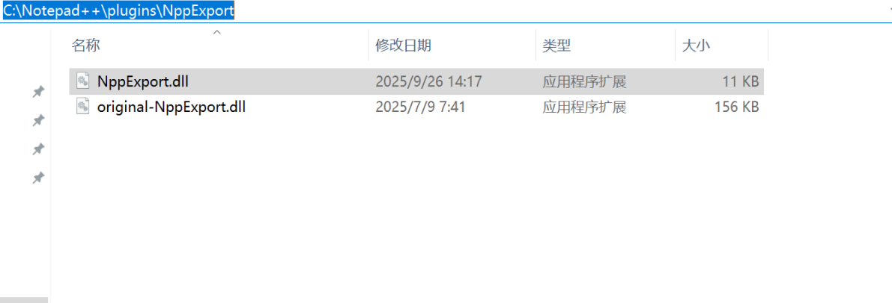
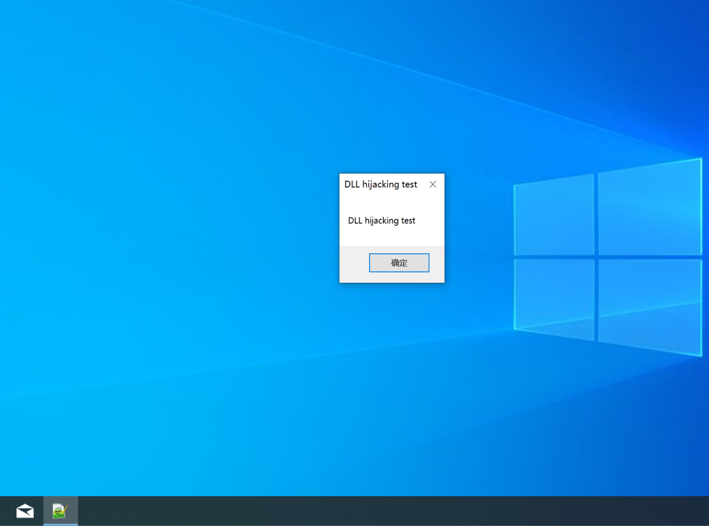

Notepad++ v8.8.3 has a DLL hijacking vulnerability, which can replace the original DLL file to execute malicious code.

The example method is as follows:
(Please note that the following demonstration uses npp.8.8.3.Installer.x64.exe to install Notepad++for testing, but in reality, any installed Notepad++is affected by this vulnerability)

Replace the original DLL (such as Notepad++\plugins\NppExport\NppExport.dll) with a DLL file with the same name containing malicious code (the original export function is forwarded to the original DLL), so that when executing Notepad++. exe, malicious code can be executed.

Among them, original-NppExport.dll is the original DLL, while NppExport.dll is a forged one

Then click notepad++.exe and successfully hijack

 
 
 
 
 
 
 
 

[ Disclaimers ]  

Regarding vulnerability exploitation and security risks:  
The purpose of this repository is to promote security research and vulnerability remediation, rather than to encourage or guide any unauthorized vulnerability exploitation. Unauthorized exploitation or attack of any system or network is illegal and may pose serious security risks and legal consequences to individuals and organizations.   
The author explicitly opposes any unauthorized exploitation of vulnerabilities and reminds users to comply with relevant laws, regulations, and ethical guidelines.

Legal Liability and Limitations:  
Under no circumstances shall the author be liable for any direct, indirect, incidental, special, punitive, or consequential damages (including but not limited to loss of profits, data loss, business interruption, or computer system failure) arising from the use or inability to use the information in this repository, even if the author has been informed of the possibility of such damages.  

User Responsibility:  
Users should ensure that their behavior complies with local laws, regulations, and ethical standards when using the information in this warehouse. Users shall bear full responsibility for their actions, including but not limited to any legal consequences or security risks arising from the use of information in this warehouse.  

Vulnerability fixes and updates:  
The author suggests that users should promptly pay attention to vulnerability repair information released by relevant vendors or project maintainers, and apply repair measures as soon as possible to protect the security of the system and data.
The author does not assume any security risks or losses caused by users' failure to apply repair measures in a timely manner.

