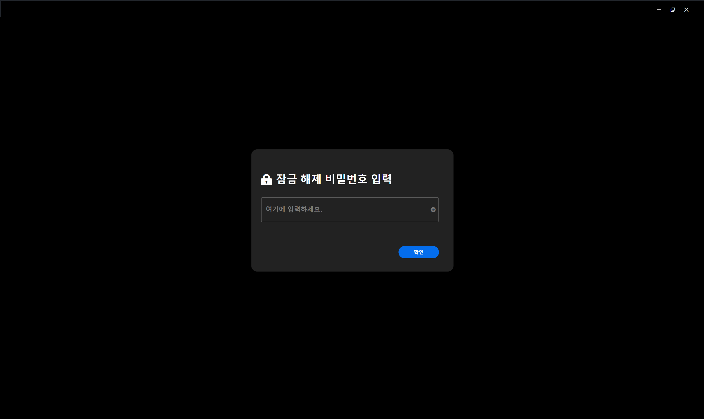

# CVE-2025-56800
### Local Authentication Bypass Vulnerability in Reolink Desktop Application
## 1. Overview


<br clear="left"/>

- **Name**: Reolink Desktop Application
- **Version**: 8.18.12
- **Vendor**: Reolink
- **CWE**: [CWE-288: Authentication Bypass Using an Alternate Path or Channel](https://cwe.mitre.org/data/definitions/288.html), [CWE-353: Missing Support for Integrity Check](https://cwe.mitre.org/data/definitions/358.html)
- **CVSS**: 
- **Vector String**: 
## 2. Summary
The Reolink Desktop Application (version 8.18.12) contains a local authentication bypass vulnerability in its lock screen feature. The application's source code is not packaged in an ASAR archive, leaving critical authentication logic, such as password verification, exposed in plaintext within client-side JavaScript files. Simply modifying the logic in this exposed code is sufficient to neutralize the password check and bypass the lock screen.
## 3. Details
The lock screen password is stored and retrieved via JavaScript code in the local resource bundle, specifically:
```
%LOCALAPPDATA%\Programs\Reolink\resources\app\~node_modules_sharp_vendor_Sync_recursive_versions_json_~private_main_index_ts.js
```
The relevant code registers a handler for the command `get_settings_lock_screen_password`, which returns the stored password from the `a.settingsManager.lockScreenPassword` property:
```javascript
this.registerCommonCmd(
  "get_settings_lock_screen_password",
  "",
  R(function () {
    return N(this, function (e) {
      return [2, a.settingsManager.lockScreenPassword];
    });
  }),
);
```
Since this logic resides entirely on the client side, an attacker can patch the return value to "" (an empty string), effectively bypassing the lock screen:
```javascript
return [2, ""];
```
After modifying and saving this file, the application will treat the lock screen as having no password, thereby granting access without any authentication.  

This vulnerability allows any local attacker with file system access to bypass application-level authentication and gain full access to the application interface and settings.  

Since the password is not validated against any external source and is exposed via modifiable JavaScript, this lock screen offers no real protection.
## 4. Proof of Concept (PoC)
The code's content can be tampered with by executing [poc.py](poc.py).  

The following screenshot shows the Reolink application's lock screen before patching, with a password prompt enabled: 

The following screenshot shows the application after applying the patch and restarting, with no password prompt displayed:


## 5. Recommendations
The application code must be packaged into an ASAR archive, and an integrity verification process, such as checking the ASAR file's hash value or signature, must be implemented at startup. Any application that has been tampered with must be blocked from executing.  

Critical authentication logic, such as lock screen password verification, should be handled within native binary code which is more difficult to tamper with, rather than in JavaScript, wherever possible, or be processed through server side communication.
## 6. References
