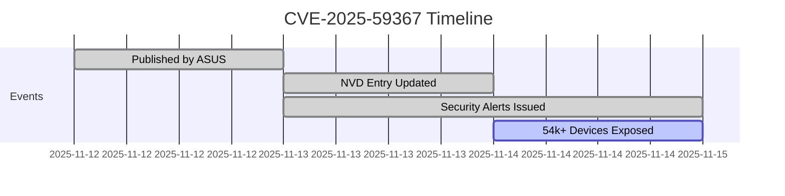

# 🚨 **CVE-2025-59367** Critical Authentication Bypass in ASUS DSL Routers 

> **Remote attackers can fully control your router — no password needed!** 😱

Based on the provided metadata, here's a structured table summarizing the key details of this critical vulnerability. This appears to be a newly published authentication bypass issue affecting ASUS DSL routers, allowing unauthorized remote access. For real-time updates, I recommend checking official sources like the NVD or ASUS security advisories.

| Field          | Value                          |
|----------------|--------------------------------|
| **Title**     | CVE-2025-59367 – ASUS DSL Router Authentication Bypass |
| **Severity**  | Critical                       |
| **CVSS Score**| 9.3 / 10                       |
| **Published** | 2025-11-12                     |
| **Last Updated** | 2025-11-13                  |
| **Vendor**    | ASUS                           |
| **CVE ID**    | CVE-2025-59367                 |
| **CWE ID**    | CWE-288 (Authentication Bypass Using an Alternate Path or Channel) |
| **Status**    | Published                      |

---

## 📖 **Vulnerability Summary**

| Field | Details |
|------|---------|
| **Description** | Authentication bypass via alternate path/channel |
| **Impact** | Full device compromise: config changes, backdoors, botnet inclusion |
| **Attack Vector** | 🌐 **Network (Remote)** |
| **Complexity** | ⚡ **Low** |
| **Privileges** | 🔑 **None Required** |
| **User Interaction** | 👤 **None** |
| **Scope** | 🔴 **Changed** (Vulnerable system fully compromised) |

> **No public PoC yet** — but expected soon due to trivial exploitability.

---

## 📊 **CVSS v4.0 Breakdown**

```text
CVSS:4.0/AV:N/AC:L/AT:N/PR:N/UI:N/VC:H/VI:H/VA:H/SC:N/SI:N/SA:N
```

| Metric | Value | Meaning |
|--------|-------|--------|
| **🌐 AV** | `N` | Network (Internet) |
| **⚡ AC** | `L` | Low complexity |
| **🔄 AT** | `N` | No special attack requirements |
| **🔑 PR** | `N` | No privileges needed |
| **👤 UI** | `N` | No user interaction |
| **💥 VC/VI/VA** | `H/H/H` | **High impact** on CIA triad |

> **CVSS v3.1**: Analysis pending by NVD ⏳

---

## 🖥️ **Affected Products**

| Model | Vulnerable | Patched Version |
|-------|------------|------------------|
| **DSL-AC51** | `< 1.1.2.3_1010` | `1.1.2.3_1010+` ✅ |
| **DSL-N16U** | `< 1.1.2.3_1010` | `1.1.2.3_1010+` ✅ |
| **DSL-N16P** | `< 1.1.2.3_1010` | `1.1.2.3_1010+` ✅ |
| **DSL-AC750** | `< 1.1.2.3_1010` | `1.1.2.3_1010+` ✅ |

> **Global Exposure**: **54,200+ devices** still online (FOFA, Nov 14, 2025) 😵  
> [FOFA Search Query](https://en.fofa.info/result?qbase64=YXBwPSJBU1VTLURTTC1BQzUxIiB8fCBhcHA9IkFTVVMtRFNMLU4xNlUiIHx8IGFwcD0iQVNVUy1EU0wtTjE2UCIgfHwgYXBwPSJBU1VTLURTTC1BQzc1MCI%253D)

---

## ⏰ **Timeline**



---

## ⚔️ **Exploitation Path**

```bash
1. 🌐 Scan: nmap -p80,443 --open -sV <target_range>
2. 🕳️  Bypass: Use alternate auth path (details in ASUS advisory)
3. 👑 Gain: Root shell access
4. 🤖 Deploy: Malware, botnet, lateral movement
```

> **No authentication. No interaction. Just internet access.**

---

## 🛡️ **Mitigation & Patch**

### **Immediate Action Required**

```diff
+ UPDATE FIRMWARE TO 1.1.2.3_1010 OR LATER
```

**Download Links**:
- [DSL-AC51](https://www.asus.com/networking-iot-servers/modems/all-series/dsl-ac51/helpdesk_download/) 🔗
- [DSL-N16 / N16P](https://www.asus.com/networking-iot-servers/modems/all-series/dsl-n16/helpdesk_download/) 🔗
- [DSL-AC750](https://www.asus.com/networking-iot-servers/modems/all-series/dsl-ac750/helpdesk_download/) 🔗

### **Workarounds (Pre-Patch)**

```yaml
- Disable WAN remote management
- Restrict admin UI to LAN IPs only
- Change default credentials
- Enable automatic updates
```

### **Detection Script**

```bash
# Quick scan for exposed ASUS DSL routers
nmap -p 80,443 --script http-title -iL targets.txt | grep -i "ASUS.*DSL"
```

---

## 📚 **Official References**

| Source | Link |
|-------|------|
| **NVD** | [nvd.nist.gov/vuln/detail/CVE-2025-59367](https://nvd.nist.gov/vuln/detail/CVE-2025-59367) 🔗 |
| **ASUS Advisory** | [asus.com/security-advisory](https://www.asus.com/security-advisory) 🔗 |
| **CVE.org** | [cve.org/CVERecord?id=CVE-2025-59367](https://cve.org/CVERecord?id=CVE-2025-59367) 🔗 |
| **SecurityOnline** | [Full Analysis](https://securityonline.info/cve-2025-59367) 🔗 |

> **False Positive Alert**: Debian tracker incorrectly lists Mattermost — **IGNORE**. This CVE is **ASUS DSL only**.

---

## 🐦 **Community Alerts on X**

| User | Message | Time |
|------|-------|------|
| `@fofabot` | `54,200+ exposed ASUS DSL routers! Patch NOW!` | Nov 14, 04:19 |
| `@taku888infinity` | `CVE-2025-59367 = Full remote takeover. Update firmware!` | Nov 14, 03:05 |
| `@CCBalert` | `Critical ASUS flaw — patch your DSL router today!` | Nov 13, 20:53 |
| `@VulmonFeeds` | `New CVE: Auth bypass in ASUS DSL-AC51, N16U, AC750` | Nov 13, 09:52 |

---

<div align="center">

## 🚨 **FINAL WARNING**

> **If your ASUS DSL router is online and unpatched → YOU ARE AT RISK.** 😰  

### **DO THIS NOW**:
```bash
1. Download patch from ASUS
2. Disable remote access
3. Monitor logs
```

**Stay secure. Patch fast.** 🌟

</div>
