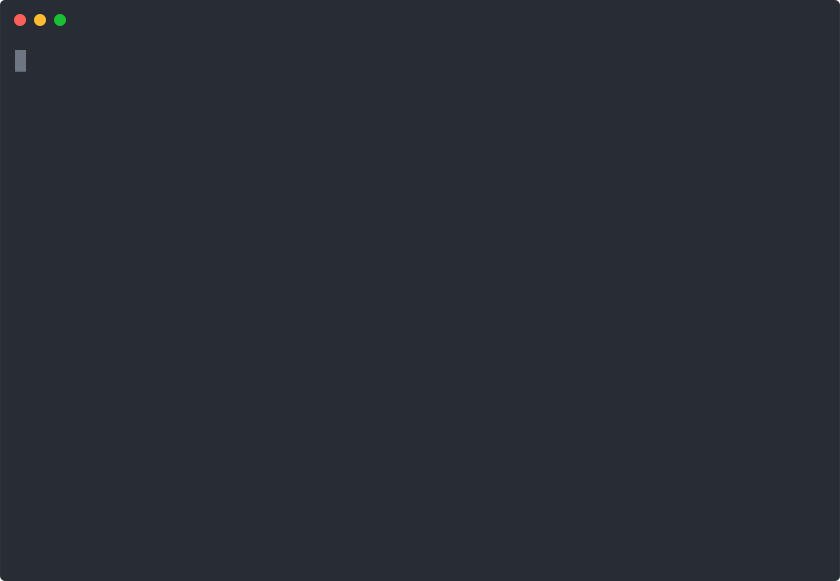

# CVE-2025-6019 Proof of Concept (PoC)

This repository contains a Proof of Concept (PoC) script for **CVE-2025-6019**, a Local Privilege Escalation (LPE) vulnerability in `libblockdev` and `udisks`. The script creates an XFS filesystem image with an SUID `bash` binary and exploits the vulnerability to mount it without the `nosuid` option, allowing a root shell.

**WARNING**: This PoC is for educational and testing purposes only. Use it only on systems you are authorized to test. Unauthorized use is illegal and unethical.





## Features
- **Local Mode**: Creates a `300` MB XFS image with an SUID `bash` binary (requires root).
- **Target Mode**: Exploits the vulnerability on a target system to gain a root shell.
- **Robust Error Handling**: Includes retries for filesystem resize and SUID checks, with detailed debugging output.
- **Persistent Mount on Success**: Keeps the filesystem mounted with a background process if the exploit succeeds, preserving the SUID binary.
- **Cleanup**: Removes temporary files, loop devices, and mounts on failure; manual cleanup required on success.

## Prerequisites
 **Operating System**: 
- Tested on:
  - openSUSE Leap 15.6
  - Kali GNU/Linux Rolling 2023.4 (`kernel 6.6.15-amd64`); may work on other Linux distributions with vulnerable `udisks2`/`libblockdev` versions (e.g., Kali Linux).
- **Dependencies**:
  - `dd`, `mkfs.xfs`, `mount`, `umount`, `udisksctl`, `gdbus`, `killall`, `grep`, `chmod`, `cp`
  - Install on Debian-based systems: `sudo apt-get install coreutils xfsprogs udisks2 libblockdev-utils`
  - Install on RPM-based systems: `sudo zypper install coreutils xfsprogs udisks2 libblockdev`
- **Root Access**: Required for `[L]ocal` mode to create the XFS image.
- **Vulnerable System**: A system with a vulnerable version of `udisks2`/`libblockdev` (specific versions for CVE-2025-6019 are unknown; verify manually).

## Usage

```bash
$ git clone https://github.com/guinea-offensive-security/CVE-2025-6019
$ cd CVE-2025-6019
$ chmod +x exploit.sh
$ bash exploit.sh
```

Then generate the `xfs.image` and transfert it into your victim Machine with the `exploit.sh` & then execute it with the `C` flag
