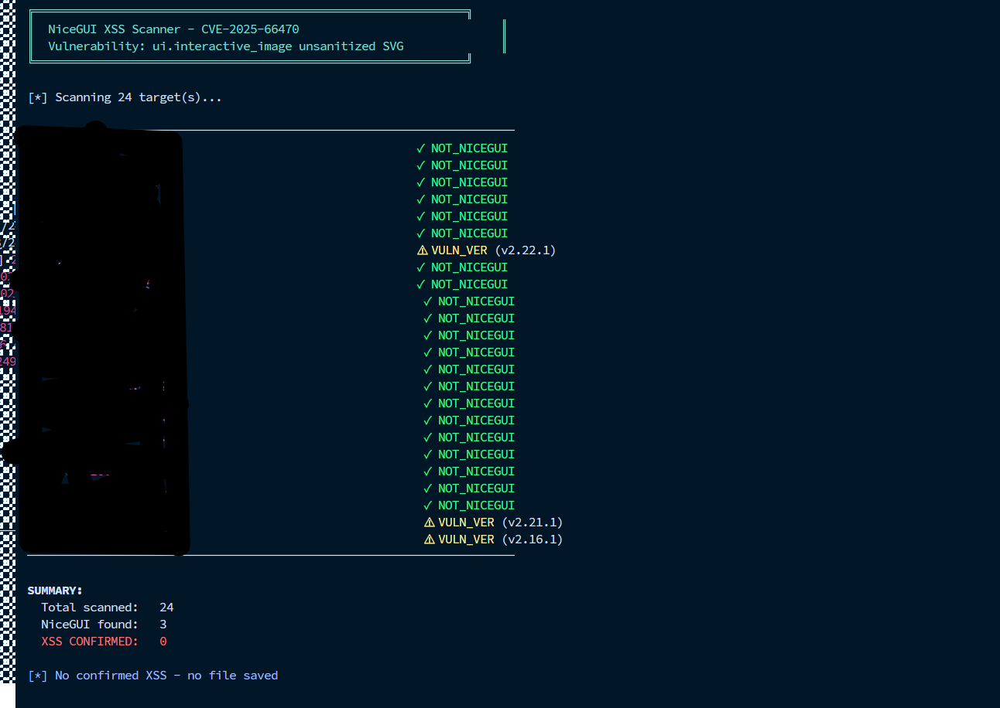

# NiceGUI XSS Scanner - CVE-2025-66470


## 📸 Screenshot

  


** A fast, simple scanner for detecting **CVE-2025-66470** - XSS vulnerability in NiceGUI's `ui.interactive_image` component.
**
## 🔍 Vulnerability Details

| Field | Value |
|-------|-------|
| **CVE** | CVE-2025-66470 |
| **GHSA** | GHSA-2m4f-cg75-76w2 |
| **Component** | `ui.interactive_image` |
| **Affected** | NiceGUI ≤ 3.3.1 |
| **Fixed** | NiceGUI 3.4.0+ |
| **Type** | Stored/Reflected XSS |

### Root Cause
The `ui.interactive_image` component renders SVG content using Vue's `v-html` directive without sanitization, allowing XSS via `<foreignObject>` tag.

**Vulnerable Code:**
```javascript
<g v-html="content"></g>
```

## 📦 Files

| File | Description |
|------|-------------|
| `nicegui_scanner.py` | **Simple scanner** - Clean one-line output per target |
| `nicegui_xss_scanner.py` | **Full scanner** - Detailed analysis with reports |
| `targets.txt` | Sample targets file for batch scanning |

## 🚀 Quick Start

### Installation

```bash
git clone https://github.com/yourusername/nicegui-xss-scanner.git
cd nicegui-xss-scanner
pip install requests
```

### Usage

**Single Target:**
```bash
python nicegui_scanner.py http://target.com/
```

**Batch Scan (from file):**
```bash
python nicegui_scanner.py -l targets.txt
```

**Full Analysis:**
```bash
python nicegui_xss_scanner.py http://target.com/
```

## 📋 Options

```
usage: nicegui_scanner.py [-h] [-l LIST] [--timeout TIMEOUT] [target]

NiceGUI XSS Scanner - CVE-2025-66470

positional arguments:
  target                Target URL

options:
  -h, --help            Show help message
  -l, --list LIST       File with URLs (one per line)
  --timeout TIMEOUT     Request timeout (default: 10)
```

## 📊 Output Examples

### Simple Scanner
```
╔══════════════════════════════════════════════════════════════╗
║  NiceGUI XSS Scanner - CVE-2025-66470                        ║
╚══════════════════════════════════════════════════════════════╝

[*] Scanning 3 target(s)...

──────────────────────────────────────────────────────────────────────
[1/3] http://192.168.1.10:8080/... 🚨 CONFIRMED (v2.1.0)
[2/3] http://192.168.1.20:5000/... ⚠ VULN_VER (v3.3.0)
[3/3] http://example.com/...       ✓ NOT_NICEGUI
──────────────────────────────────────────────────────────────────────

SUMMARY:
  Total scanned:  3
  XSS CONFIRMED:  1

✓ Saved: nicegui_CONFIRMED_174530.txt
```

### Status Legend

| Status | Meaning |
|--------|---------|
| 🚨 **CONFIRMED** | XSS vulnerability confirmed (all 3 checks passed) |
| ⚠ **VULN_VER** | Vulnerable version detected, needs manual testing |
| ✓ **NOT_NICEGUI** | Not a NiceGUI application |

## 🧪 3-Check Confirmation System

For XSS to be marked as **CONFIRMED**, all 3 checks must pass:

1. **CHECK 1:** Payload marker is reflected in response
2. **CHECK 2:** Dangerous HTML patterns (`` to embed HTML:

```html
<foreignObject>
  <body xmlns="http://www.w3.org/1999/xhtml">
    
  </body>
</foreignObject>
```

## 📄 targets.txt Format

```
# Comments start with #
http://target1.com/
http://target2.com:8080/
https://target3.com/login
```

## 🔧 Requirements

- Python 3.8+
- `requests` library

```bash
pip install requests
```

## 📚 References

- [GitHub Advisory - GHSA-2m4f-cg75-76w2](https://github.com/advisories/GHSA-2m4f-cg75-76w2)
- [NVD - CVE-2025-66470](https://nvd.nist.gov/vuln/detail/CVE-2025-66470)
- [Fix Commit](https://github.com/zauberzeug/nicegui/commit/58ad0b36e19922de16bbc79ea3ddd29851b1a3e3)

## ⚠️ Disclaimer

This tool is for **authorized security testing only**. Use responsibly and only on systems you have permission to test.

## 📜 License

MIT License - See [LICENSE](LICENSE) for details.
