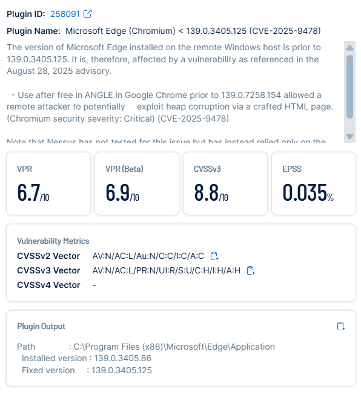
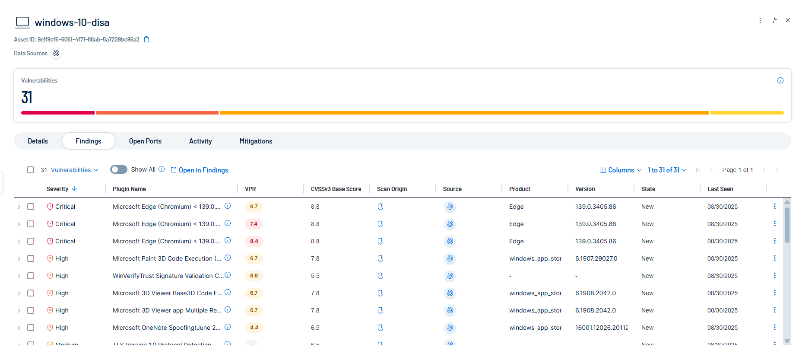

# STIG – Microsoft Edge (Chromium) < 139.0.3405.125 Remote Code Execution (CVE-2025-9478, Plugin ID: 258091)

## Before
- **Finding:** Microsoft Edge (version 139.0.3405.86) was outdated and vulnerable to a critical Remote Code Execution (RCE) flaw (CVE-2025-9478).  
- **Risk:** Attackers could exploit a use-after-free in ANGLE to execute arbitrary code through crafted HTML pages.  
- **Evidence:**  
    
    

---

## Remediation
1. Updated Microsoft Edge to version `139.0.3405.125` (patched).  
2. Verified the version update (`edge://settings/help`).  
3. Restarted Edge to finalize the patch.  
4. Performed a Tenable rescan to confirm the vulnerability was resolved.  

---

## After
Microsoft Edge successfully updated to version `139.0.3405.125`, mitigating CVE-2025-9478 and preventing potential remote code execution.  

**Evidence:**  
Edge-After-Details.png  
Edge-After-Tenable-Rescan.png

