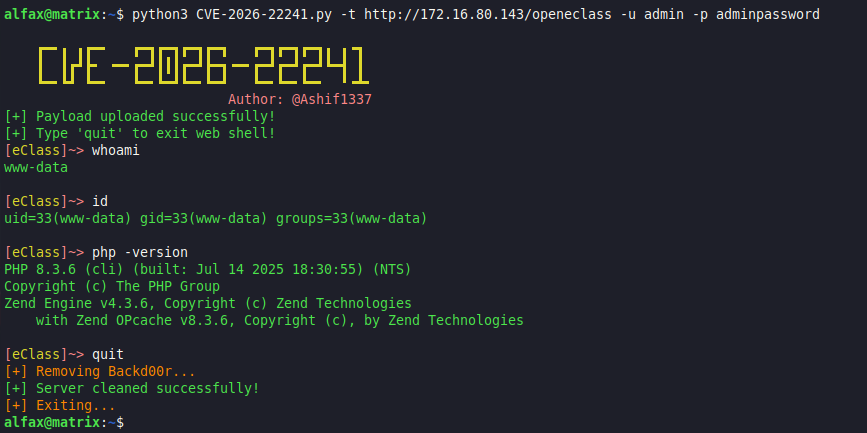

# CVE-2026-22241 : Open eClass Remote Code Execution (RCE)

This exploit uses CVE-2026-22241 automates the login, ZIP creation, upload process and providing webshell directly on the server and removes it automatically once the exploit is completed.

# Description
An Unrestricted File Upload vulnerability in the Theme Import functionality of Open eClass (prior to version 4.2) allows an attacker with administrative privileges to achieve Remote Code Execution (RCE).


**Vulnerability Details**
- CVE ID: CVE-2026-22241
- Vulnerability Type: CWE-434: Unrestricted Upload of File with Dangerous Type
- Affected Version: < 4.2
- Fixed Version: 4.2


# Exploitation

Installation

```bash
git clone https://github.com/Ashifcoder/CVE-2026-22241.git

cd CVE-2026-22241/
```

```bash
pip install -r requirements.txt
```

Usage

```bash
python3 CVE-2026-22241.py -t http://127.0.0.1/openeclass -u admin -p adminpassword
```


Options Help

```bash
usage: CVE-2026-22241.py [-h] -t ECLASSURL -u USERNAME -p PASSWORD

Open eClass Unrestricted File Upload RCE Exploit [ CVE-2026-22241 ]
Example: CVE-2026-22241.py -t http://127.0.0.1/openeclass -u admin -p adminpassword

options:
  -h, --help            show this help message and exit
  -t ECLASSURL, --eclassUrl ECLASSURL
                        Target URL of the Open eClass.
  -u USERNAME, --username USERNAME
                        Admin Username for login.
  -p PASSWORD, --password PASSWORD
                        Admin Password for login.
```


# Acknowledgements

- [RoboGR00t](https://github.com/RoboGR00t) for initial research on Open eClass GUnet.
- [FreySolarEye](https://github.com/FreySolarEye) for research on Open eClass GUnet.
- [GUnet](https://www.openeclass.org/) for their ongoing commitment to enhancing platform security.


# Disclaimer

This script is for educational purposes and authorized security testing only. The author is not responsible for any damage caused by the misuse of this tool. Use responsibly and only on systems you have explicit permission to test.

# References

- GitHub Advisory: [GHSA-rf6j-xgqp-wjxg](https://github.com/gunet/openeclass/security/advisories/GHSA-rf6j-xgqp-wjxg)
- CVE ORG : [CVE-2026-22241](https://www.cve.org/CVERecord?id=CVE-2026-22241)
- NVD : [CVE-2026-22241](https://nvd.nist.gov/vuln/detail/CVE-2026-22241)